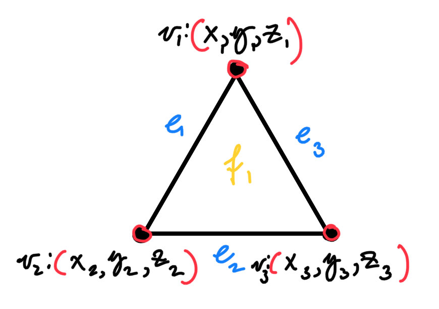

# Applied Discrete Differential Geometry

This article is for combining and summarizing the discrete differential geometry concepts into a format that is not too math heavy so that programmers can pick and choose what bits they want to implement. The article will focus mainly on surfaces as there are already a good amount of programmer facing concent online that has to do with curves. 
For the sake of simplicity we will only focus on triangle meshes in 3D. 


# Data

First, lets define what our fundamental data building blocks are and how to store them. Since we are working with triangles we have data such as vertices (points)`V`, edges (lines) `E`, and faces (sides) `F`. For "nice" meshes an edge must be defined by two vertices, a face by three edges or vertices, and an edge is constrained by exactly two faces.

Add picture here

How we store the data and which components we put in the forefront depends on how we want to manage storage, access time, and if we care about the embedding of our mesh in space or we are more concerned with the topological attributes of our mesh.

Here are a few common ways that a triangle mesh can be stored:

* **Triangle Soup**

  Store every triangle independently as three points. This is the simplest implementation where we just store three points for each triangle that makes up the mesh, thus our data is a list of vertices `V` where `|V|`=`3|F|` where `F` is a list of faces.

  * **Storage:** High, because shared vertices are duplicated.
  * **Operations:** Triangle access and rendering are simple, but adjacency queries are slow without preprocessing.
  * **Tradeoff:** Good for raw rendering or messy imported geometry, but bad for DDG because there is no explicit connectivity.

* **Indexed Face Set**

  Store a vertex list `V` and a face list `F`, where each face stores three indices into `V`. Now we have two separate sources of data but have removed storage of duplicate vertices.

  * **Storage:** Low. Vertices are shared, and each triangle only stores three indices.
  * **Operations:** Accessing vertices and faces is `O(1)`. Iterating over all faces is `O(F)`. Neighbor queries are slow unless extra adjacency is built.
  * **Tradeoff:** Simple, compact, and great for numerical algorithms, but not ideal for local traversal by itself.

* **Indexed Face Set with Adjacency**

  Store `V` and `F`, plus extra lookup tables such as vertex-to-faces, edge-to-faces, or face-to-faces.

  * **Storage:** Medium. Extra adjacency tables add memory proportional to the number of vertices, edges, and faces.
  * **Operations:** Building adjacency is usually `O(F)` with hashing or `O(F log F)` with sorting. After that, one-ring and neighboring-face queries are fast.
  * **Tradeoff:** A practical middle ground for DDG. Good for normals, curvature, Laplacians, smoothing, and geodesics.

* **Corner Table**

  Treat each triangle as three corners. Each corner stores its vertex and the opposite corner across the edge.

  * **Storage:** Medium-low. There are `3|F|` corners, with a small amount of data per corner.
  * **Operations:** Moving around triangles and across edges is `O(1)`. Vertex one-ring traversal is `O(deg(v))`.
  * **Tradeoff:** Compact and fast for triangle-only meshes, but less flexible than halfedge structures.

* **Halfedge Structure**

  Split each edge into two directed halfedges. Each halfedge stores links like `next`, `twin`, `vertex`, and `face`.

  * **Storage:** Higher. Each edge becomes two halfedges, and each halfedge stores several indices or pointers.
  * **Operations:** Local traversal is fast. Moving to a neighboring face is `O(1)`, and walking a vertex one-ring is `O(deg(v))`.
  * **Tradeoff:** Excellent for remeshing, boundary traversal, edge flips, splits, collapses, and editing. More complex to implement than `V,F`.


* **Winged Edge**

  Store the mesh around edges. Each edge stores its endpoint vertices, neighboring faces, and neighboring edges.

  * **Storage:** High, because each edge stores many connectivity links.
  * **Operations:** Edge-centered adjacency queries are fast.
  * **Tradeoff:** Powerful but usually more complicated than needed for beginner DDG work.


For our purposes, an **indexed face set with adjacency tables** will. It is simple enough to implement, but still supports the local neighborhoods needed for normals, curvature, Laplacians, and other surface operators. We also wont focus on real time mesh editing so the speed of updates is not that important.




Indexed Face Set:
```
V = [
    (x_0, y_0, z_0),
    (x_1, y_1, z_1),
    (x_2, y_2, z_2),
    ...
]

F = [
    (v0, v1, v2),
    (v2, v1, v3),
    ...
]
```

Indexed Face Set with Edges and Adjacency:

From the face list we can derive an edge list:
```
E = [
    (v0, v1),
    (v1, v2),
    (v2, v0),
    ...
]
```

Since the same edge may appear in two different triangles, we usually store each edge in a canonical order:
```
edge(a, b) = (min(a, b), max(a, b))
```
This lets us build lookup tables such as:
```
# Exactly two faces per edge that is itself defined by exactly two vertices (for closed manifold meshes)
edge_to_faces = {
    (v0, v1): [f0, f3],
    (v1, v2): [f0, f1],
    ...
}

# Which faces the point is part of
# (Vertices which are center points of fans can have many associated faces)
vertex_to_faces = { 
    v0: [f0, f2, f5],
    v1: [f0, f1, f4, f6],
    ...
}

# vertex valence or edge degree
vertex_to_vertices = {
    v0: [v1, v2, v5],
    v1: [v0, v2, v3, v6, v7],
    ...
}

face_to_faces = {
    f0: [f1, f2, f3], # exactly 3 faces per face for closed meshes
    ...
}
```
In code, the construction is usually done by looping over every face and inserting its three edges into a map.

```

def canonical_edge(a, b):
    return (min(a, b), max(a, b))


def build_adjacency(F):
    edge_to_faces = {}
    vertex_to_faces = {}
    vertex_to_vertices = {}

    for fi, (a, b, c) in enumerate(F):
        verts = [a, b, c]
        edges = [
            canonical_edge(a, b),
            canonical_edge(b, c),
            canonical_edge(c, a),
        ]

        # Vertex -> faces
        for v in verts:
            if v not in vertex_to_faces:
                vertex_to_faces[v] = []
            vertex_to_faces[v].append(fi)

        # Edge -> faces
        for e in edges:
            if e not in edge_to_faces:
                edge_to_faces[e] = []
            edge_to_faces[e].append(fi)

        # Vertex -> neighboring vertices
        for u, v in [(a, b), (b, c), (c, a)]:
            if u not in vertex_to_vertices:
                vertex_to_vertices[u] = set()
            if v not in vertex_to_vertices:
                vertex_to_vertices[v] = set()

            vertex_to_vertices[u].add(v)
            vertex_to_vertices[v].add(u)

    return edge_to_faces, vertex_to_faces, vertex_to_vertices

# Once we have edge_to_faces, we can also build face_to_faces.

def build_face_adjacency(F, edge_to_faces):
    face_to_faces = {fi: set() for fi in range(len(F))}

    for edge, faces in edge_to_faces.items():
        if len(faces) == 2:
            f0, f1 = faces
            face_to_faces[f0].add(f1)
            face_to_faces[f1].add(f0)

    return face_to_faces

```

These adjacency tables give us the basic local neighborhoods used throughout discrete differential geometry.
```
vertex_to_vertices[v]  -> the one-ring neighbors of vertex v
vertex_to_faces[v]     -> the faces touching vertex v
edge_to_faces[e]       -> the faces touching edge e
face_to_faces[f]       -> the faces adjacent to face f
```
This representation is still simple, but now we can ask geometric and topological questions efficiently. For example, an edge with only one incident face is a boundary edge:

```
boundary_edges = [
    edge for edge, faces in edge_to_faces.items()
    if len(faces) == 1
]
```

For this article, this will be our default mesh representation. We will store the embedded geometry in V, the triangle connectivity in F, and then derive edges and adjacency tables when needed. This gives us enough structure to implement surface normals, vertex neighborhoods, curvature estimates, Laplacians, smoothing, geodesics, and other basic DDG operators without needing to implement a full halfedge mesh.

# Constants

Now that we have defined our data and how to store it lets find the "constant" values and metrics of our mesh, that we will later use to define some more interesting operations. 

Lets start of with the simple extrinsic values such as lengths / angles, areas and volumes.

## Lengths and Angles

### Lengths
Edge lengths are simply the Euclidean distance between two points. 

`l_ij = ||p_j - p_i||`
or more explicitly: `l_ij = sqrt((x_j - x_i)^2 + (y_j - y_i)^2 + (z_j - z_i)^2)`.


### Angles

After edge lengths, the next useful local quantities are angles. For triangle meshes there are two main kinds of angles we care about:

1. Face / corner angles: angles inside each triangle

2. Edge / dihedral angles: angles between two neighboring triangles

The **face angles** are the three interior angles of a triangle. For a face $f = (i, j, k)$ there is one angle at each vertex and the three angles should always add up to 180 degrees or $\pi$ radians. The angle at vertex $i$ is the angle between the two edge vectors leaving $i$:

```txt
u = p_j - p_i
v = p_k - p_i
```

So:

```txt
theta = arccos(dot(u, v) / (||u|| ||v||)) = atan2(||u × v||, dot(u, v))
```


Face angles can also be computed from edge lengths using the law of cosines. If the side lengths opposite vertices `i`, `j`, and `k` are `a`, `b`, and `c`, then:

```txt
cos(theta_i) = (b^2 + c^2 - a^2) / (2bc)
```

This is useful because it shows that corner angles are intrinsic. Once we know the triangle’s edge lengths, we know its internal angles, even if we do not know where the triangle is embedded in 3D.

Internal angles will also be useful in the future for defining curvature at vertices since the sum of internal angles at a vertex will be equal to $2\pi$ when those triangles exactly create a plane.

### Area

check notes

### Volume


