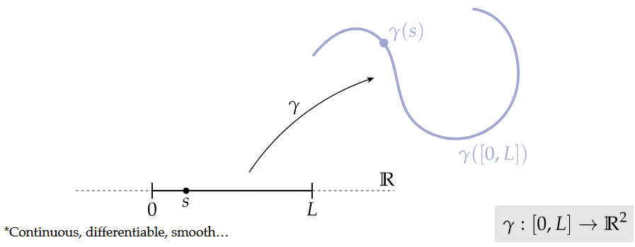
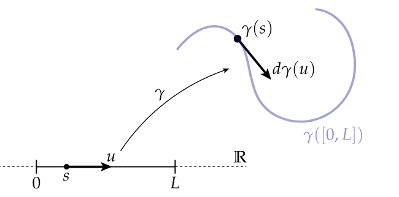
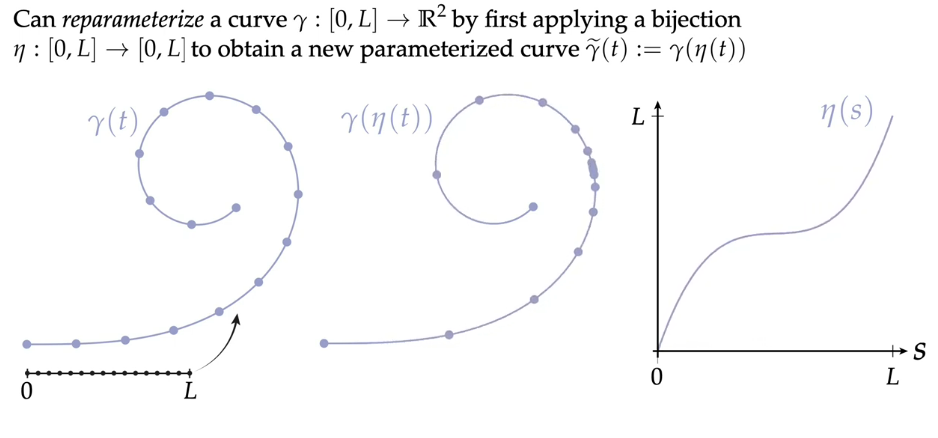
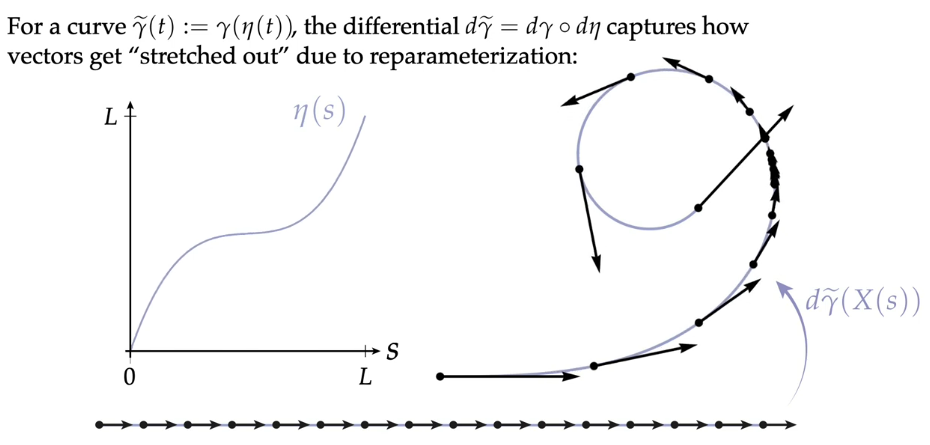
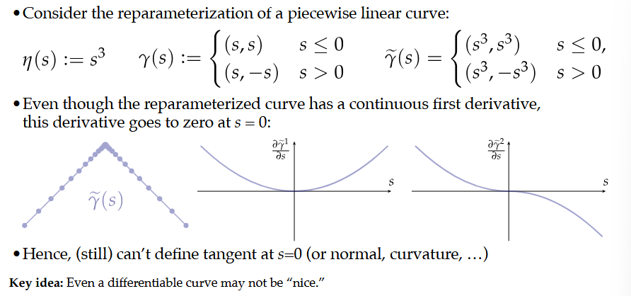

# Curves

First lets explore how to create and define curves on a plane:

A **parametrized plane curve** $\gamma$ is a map taking each point $s$ in an interval $[0, L]$ of the real line to some point in the plane $\mathbb{R}^2$.

This is a nice parametrization because it is easy to sample from and  identify crossings. It's also nice because it naturally encodes velocity as the real line is mapped to the curve. 

Specifically the **differential of a curve** says how vectors on the domain (real line) get mapped / "stretched" onto the plane.

The **unit tangent** at a point on the parametrized curve is the normalized first derivative of that point.
$$T(s) := \frac{d}{ds}\gamma(s) / |\frac{d}{ds}\gamma(s)|$$
If the derivative was already unit length for every $s$, then we say the curve is arc-length parametrized. 
$$T(s) := \frac{d}{ds}\gamma(s) = d \gamma(\frac{d}{ds})$$
The key consequence of this is
$$
\text{length of the curve from } s=a \text{ to } s=b
= \int_a^b |\gamma'(s)|\,ds
= \int_a^b 1\,ds
= b-a
$$
So arc length parametrization means that infinitesimal lengths along the parameter line are preserved ie. a tiny interval $ds$ in the domain gets mapped to a tiny curve segment of length exactly $ds$. Think of making a curve by putting a non-elastic piece of string on a paper. 

Importantly, the curve does not only depend on the definition of the mapping $\gamma(s)$ but also the distribution of the points being mapped from the domain. We can **reparametrize** a curve by applying some function $\eta$ to the initial, perhaps evenly spaced, domain $[0, L]$ that, for example concentrates the points to be sampled.
$$\gamma' := \gamma(\eta(t))$$

This reparametrization not only changes the sampling distribution /  "granularity" of the curve but also the differential along the curve. Reparametrization can be used to encode some information relating to velocity along the curve without changing the curve mapping itself. The differential of the reparametrized curve 
$$d\gamma' = d\gamma \circ d\eta$$
is the composition of the differential of the curve equation adn the differential of the sampling function. 

A parametrized curve is **regular** if the differential is nonzero everywhere ie. if the curve "never slows to zero". Without this condition, a parameterized curve may look non-smooth
but actually be differentiable everywhere, or look smooth but fail to
have well-defined tangents. Think of walking along a curve with your steps being equal to the spacing between some sampled points, if the spacing between those points go towards 0, your step sizes become zero, that is equivalent to stopping along the curve which makes the full traversal of the curve impossible. Additionally:

Another useful property of a curve is if it crosses itself or not. If it does not cross itself we call it **embedded**. More precisely if two different sampled points $s_1, s_2$ where $s_1 != s_2$ map to the same point on the plane then the curve is not embedded. 

We can also define a **normal** $N$ of a curve which is simply the quarter rotation of the unit tangent in the CC direction. In coordinates $(x, y)$ a quarter-turn can be achieved by simply exchanging x and y, and hten negating y: (x, y) -> (-y, x). 

The **curvature** $\kappa$ of an arc-length parametrized plane curve can be expressed as the rate of change in the tangent, ie acceleration. 
$$\kappa(s) = N(s) \cdot \frac{d}{ds}T(s)$$ which is equivalent to writing $$\kappa(s) = N(s) \cdot \frac{d^2}{ds^2}\gamma(s)$$ 
Note: this is only for ARC-LENGTH parametrized curves. 

We can also equivalently express curvature using hte **osculating circle** which is the circle best approximating curvature at a point $p$ by defining the circle as having to pass through $p$ and two equidistant neighbors to the "left" and "right" of $p$. As these neighbors close in on $p$ the osculating circle becomes the limiting circle.
If the osculating circle has radius $R$, then the curvature $\kappa$ is defined by $\kappa = \frac{1}{R}$
So:
- large radius $\Rightarrow$ small curvature,
- small radius $\Rightarrow$ large curvature,
- straight line $\Rightarrow R = \infty \Rightarrow \kappa = 0$.

Suppose the curve near a point behaves like its osculating circle of radius $R$. For a circle, arc length and central angle satisfy
$$s = R\theta$$
Differentiating with respect to $s$ gives
$$1 = R \frac{d\theta}{ds}$$
Hence:
$$\frac{d\theta}{ds} = \frac{1}{R}$$

But $\frac{d\theta}{ds}$ is exactly the rate at which the tangent direction changes along the curve, so curvature is

$$\kappa = \frac{d\theta}{ds} = \frac{1}{R}$$

If the curve is parameterized by a variable $t$: $\mathbf{r}(t) = (x(t), y(t)),$ then curvature is
$$\kappa=\frac{|x'y'' - y'x''|}{\left( (x')^2 + (y')^2 \right)^{3/2}}$$

The quantity $x'y'' - y'x''$ is the 2D determinant
$$\det
\begin{pmatrix}
x' & y' \\
x'' & y''
\end{pmatrix}.
$$

It measures how much the acceleration points perpendicular to the velocity.
- If acceleration is parallel to velocity, the path is not turning, so curvature is $0$.
- If acceleration has a perpendicular component, the path bends.

So curvature is basically the perpendicular turning effect / speed cubed.

