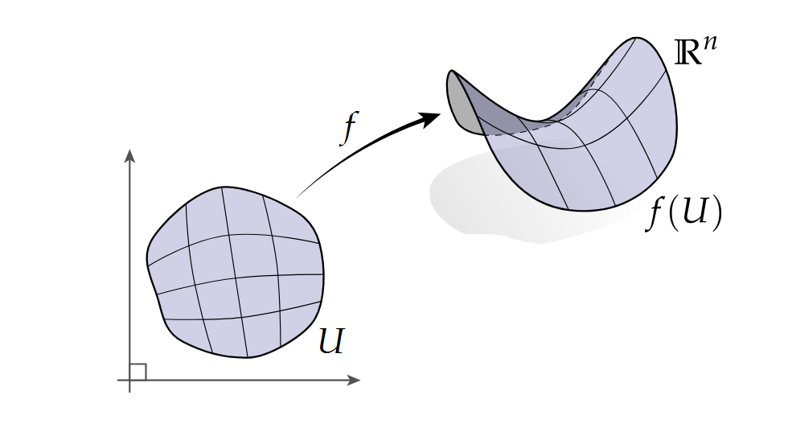
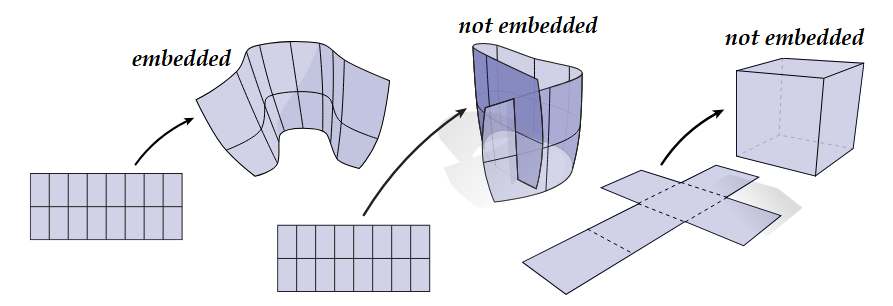
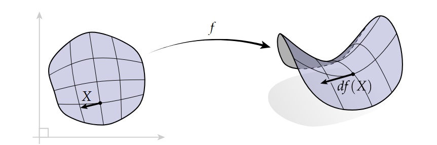
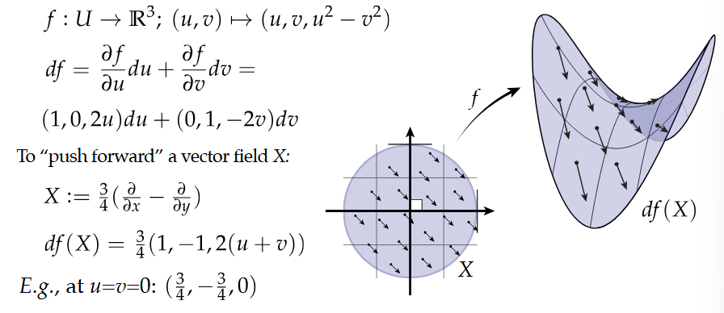
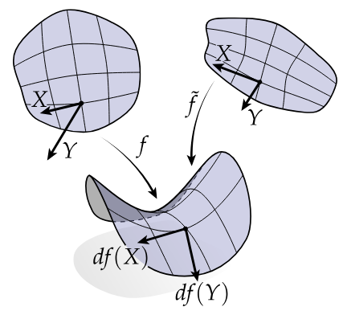
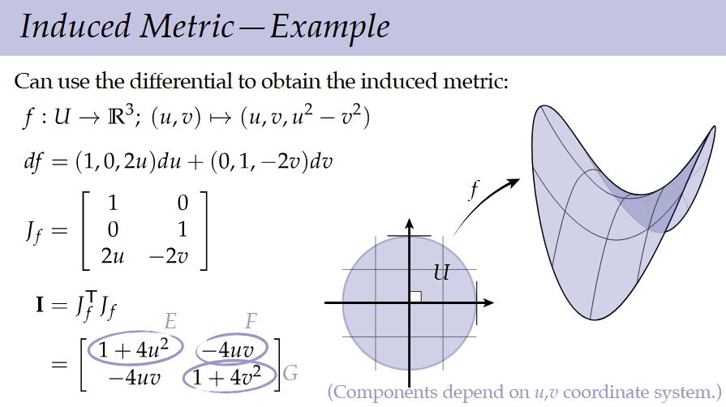
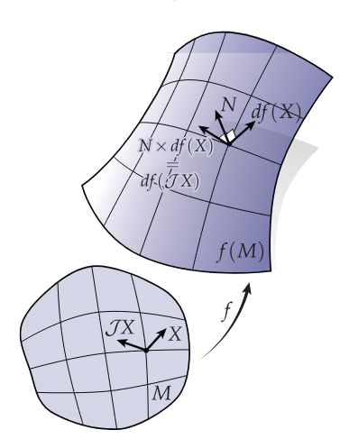

# Smooth Surfaces Lectures 1 and 2

# Lecture 1

We will start discussing surfaces from a local i.e. **extrinsic** way, where we look at local patches of geometry defined in space.

Alternatively, an **intrinsic** approach does not consider specific embeddings of the geometry in some other n-dimensional space.

An analogy is: we can look at the earth as a sphere in space ($R^3$) (extrinsic) or alternatively we can use the globe itself as defining a coordinate system (intrinsic).

## Parametrized Surface

A **parametrized surface** is a map: $f: U \rightarrow \mathbb{R}^n$ from a two-dimensional region $U \subset \mathbb{R}^2$ into space.
The set $f(U)$ is the **image** of $f$ and describes the surfaces as a subset of $\mathbb{R}^n$.

Importantly different parametrizations $f_1 / f_2$ could produce the same image. 

An **embedding** "preserves the topology" of the domain, more concretely: a parametrized surface $f$ is an **embedding** if it is a continuous bijection into its image $f(U)$ with continuous inverse $f^{-1}(U)$. 
This means that embeddings cannot cause intersections or fundamental changes to the topology of the domain. 

Now that we have defined mappings using parametric equations and embeddings as "nice" mappings lets consider the differentials of such parametrized surfaces.

## Differential

The **differential** of a parametrized surface tells us how a tangent vector on the domain gets "stretched out" into space under the mapping. 
We say that the differential $df$ "pushes forward" vectors $X$ into $\mathbb{R}^n$, yielding vectors $df(X)$.

Algebraically, the differential is the exterior derivative of the parametrization. 

The matrix representation fo the differential is simply the Jacobian.
Considering a map: $f: \mathbb{R}^n \rightarrow \mathbb{R}^m$ and let $x_1, ... ,x_n$ be coordinates on $\mathbb{R}^n$.
Then the **Jacobian** of $f$ is the matrix:

$$ J_f =
\begin{bmatrix}
\dfrac{\partial f_1}{\partial x_1} & \dfrac{\partial f_1}{\partial x_2} & \cdots & \dfrac{\partial f_1}{\partial x_n} \\
\dfrac{\partial f_2}{\partial x_1} & \dfrac{\partial f_2}{\partial x_2} & \cdots & \dfrac{\partial f_2}{\partial x_n} \\
\vdots & \vdots & \ddots & \vdots \\
\dfrac{\partial f_m}{\partial x_1} & \dfrac{\partial f_m}{\partial x_2} & \cdots & \dfrac{\partial f_m}{\partial x_n}
\end{bmatrix}
$$
where $f_1, ..., f_m$ are the components of $f$ with respect to some coordinate system on $\mathbb{R}^m$.
This matrix represents the differential in the sense that $df(X) = J_fX$.

The Jacobian matrix is nice in some computational settings but we will keep with the differential view for our purposes. 

## Immersed Surfaces

A map $f: U \rightarrow \mathbb{R}^n$ is an **immersion** if its differential $df$ is nondegenerate:
$$df(X)|_p = 0 \Longleftrightarrow X|_p = 0 \quad \forall \in U$$

This can be read as the differential of $X$ at point p is only 0 if and only if $X$ itself is 0 at that point. Alternatively, this means that non-zero vectors in $X$ must have non-zero differentials. This is similar to $C1$ continuity on curves. 
Note: Immersed surfaces does not mean that there are no self-intersections, it only guarantees that no region of the surface get "pinched" or "squashed" allowing for the nice mapping of tangents and normals. 

## Immersion vs. Embedding

Immersions basically ensure that when applying maps the quantities such as tangents, normals, or other metrics do not degenerate, even if there are self-intersections. More broadly immersions ensure "nice" local properties of a mesh between mappings while embeddings ensure that the global structure of a mesh, number of holes, etc. remain the same under mappings. 

## Regular Homotopy

Now that we have defined mappings and "nice" mappings in the form of embeddings and immersions, lets see how we can interpolate or change a surface between two immersions $f_0$ and $f_1$. A **regular homotopy** is a notion of a "nice motion" or "nice transformation" between two immersions. More formally given two immersions $f_0$ and $f_1$ of the same domain $U$ then our homotopy $h$ is a continuous map $U \times [0,1]$. In other words between time 0 and 1 we have a continuos mapping over space and time bound by time: $t:[0,1]$ and mappings $f:[f_0, f_1]$. Then obviously the homotopy at time 0: $h(x, 0) = f_0(x)$ and at time 1: $h(x, 1) = f_1(x)$ and $h(x,t)$ is an immersion for all $t$, i.e. as we interpolate between the two maps the mapping at $t$ does not have degenerate differential(s). (No pinching, creasing, or tangents becoming 0). 

## Riemann Metric

The idea behind a Riemannian metric $g(X, Y)$ is that given two tangent vectors $X$ and $Y$ originating from the same point $p$ the Riemannian metric encodes how the inner product between the two tangents differ once the patch that the two tangents are on, are immersed. 

Since our surface will get stretched and bent under our immersion $f$ the inner product between $X$ and $Y$ on the two-dimensional region $U \subset \mathbb{R}^2$ will not be the same once undergoing the mapping to $\mathbb{R}^n$. Furthermore, depending on our parametrization of $f$ using just the inner product on our original plane can give the same result for any parametrization. So what we want to do instead is push forward $X$ and $Y$ into space, take their differential, and then take their inner product; defining the **induced Riemannian metric**. 
$$g(X, Y) = \langle df(X), df(Y) \rangle$$

So the key idea is by using the differential of the map $f$ in the inner product we account for the induced stretching of the immersion. 

We can use a matrix representation for the induced metric that is a bilinear map from a pair of vectors to a scalar, which we can represent as a $2x2$ matrix $I$ called the **first fundamental form**.
$$g(X, Y) = \langle df(X), df(Y) \rangle = X^TIY$$
where $I_{ij} = g(\frac{\partial}{\partial x^i}, \frac{\partial}{\partial x^j}) = \langle df(\frac{\partial}{\partial x^i}), df(\frac{\partial}{\partial x^j}) \rangle$

Furthermore, $I = J_f^TJ_f$ where $J$ is the Jacobian. 

Note: the induced metric depends on the point $p$!!!

This matrix is always symmetric since the inner product is symmetric, $u \cdot v = v \cdot u$

For surfaces it is usually not possible to preserve all lenghts, however, we can always preserve angles (conformal mapping). A parametrization is conformal if at each point the induced metric is simply a positive rescaling (no shearing or rotation) of the 2D Euclidean metric.

### The Key Idea

The key idea of the Riemannina metric is that if we can write down the Riemannian metric at each point i.e. define how two tangents stretch at a point under an immersion then that is enough information to define the immersion without using any coordinate system explicitly (intrinsic viewpoint). 

# Lecture 2

## Gauss Map

A vector is **normal** to a surface if it is orthogonal to all tangent vectors. 
$$\forall X, \langle N, df(X) \rangle = 0$$

This definition does not guarantee a unit length normal nor a canonical normal orientation (- / +).

The **Gauss map** is a continuous map taking each point on the surface to a unit normal vector. 
We can think of the Gauss map as another surface itself derived from the continuous normals from another surface. 
Not every surface (such as a Mobius strip) has a globally continuous Gauss map. 

**Surjectivity**: given a unit normal vector $n$ we can always find some point on a surface with that normal.

**Injectivity**: given a unit normal vector $n$ we can always find all points on the surface with that normal? No you cannot, always. 
However, shapes that are strictly convex always have injective Gauss maps.

## Vector Area

Given a little patch on a surface $U$, what is the "average normal" of that patch?

We can simply integrate the normal over the patch and divide by the area:
$$\frac{1}{area(U)}\int_U NdA$$
Here the integrand $NdA$ is called the **vector area** (vector valued 2-form).

In terms of exterior calculus we can also write the vector area as:
$$df \wedge df (X, Y) = df(X) \times df(Y) - df(Y) \times df(X) = 2 df(X) \times df(Y) = 2NdA(X, Y) \therefore \mathrm{A} = \frac{1}{2}df \wedge df$$

After some algebraic manipulation we can find that the vector area can be expressed as an integral over the boundary of the patch:
$$\int_{\partial U}f(s) \times df(T(s))ds$$

Hence, the vector area is the same for any two patches with the same boundary. This is super useful especially when we will move to the discrete case. 

## Exterior Calculus of Immersed Surfaces

For a surface immersed in 3D, we just need two pieces of data:
- **Area form**: How big the given region is?
    - This lets us define Hodge star on 0/2-forms
    - can be expressed via the cross product in $R^3$
- **Complex structure**: How do we rotate by 90 degrees?
    - This lets us define the Hodge star on 1-forms
    - we can express this via cross product w/ surface normal

### Area form

If the Riemannian metric can be thought of as a notion of a dot (inner) product adjusted for immersed surfaces then what would the equivalent be for cross product, representing the signed 2D area of a surface?

We can use the area vector:

$$df \wedge df (X, Y) = 2 df(X) \times df(Y) = 2NdA(X, Y)$$
where $dA$ is the area 2-form on $f(M)$ so $dA$ can be expressed as:
$$dA = \frac{1}{2}\langle N, df \wedge df \rangle$$

Using this 2-form: $dA$, we can define the Hodge star on 0-forms as:
$f \xrightarrow{\star} fdA$

### Complex Structure

The **complex structure** tells us how to rotate tangent vectors by $90^\circ$ on the surface.

In the plane, a $90^\circ$ rotation is represented by the matrix

$$
J_{\mathbb{R}^2} =
\begin{bmatrix}
0 & -1 \\
1 & 0
\end{bmatrix}
$$

so that

$$
J_{\mathbb{R}^2}
\begin{bmatrix}
x \\
y
\end{bmatrix}
=
\begin{bmatrix}
-y \\
x
\end{bmatrix}.
$$

For an immersed surface $f : M \rightarrow \mathbb{R}^3$, we want a similar idea, but now the rotation should happen **within the tangent plane of the surface**, not merely in the flat parameter domain.

If $N$ is the unit normal to the surface, then rotating a pushed-forward tangent vector $df(X)$ by $90^\circ$ can be done using the cross product with $N$:

$$df(J_f X) = N \times df(X).$$

Here $J_f$ is the complex structure induced by the immersion $f$.

The important idea is that $J_f$ is the operation on the **domain tangent vector** $X$ that corresponds to rotating the actual surface tangent vector $df(X)$ by $90^\circ$ in $\mathbb{R}^3$.

In other words:
- $X$ is a tangent vector in the parameter domain.
- $df(X)$ is the corresponding tangent vector on the surface.
- $N \times df(X)$ rotates that tangent vector by $90^\circ$ in the surface tangent plane.
- $J_fX$ is the domain vector whose pushforward gives that rotated surface vector.

So $J_f$ is the surface-aware version of the ordinary planar rotation matrix.

### Complex Structure in Coordinates

If we want to compute the complex structure explicitly, we can write the differential as a Jacobian matrix

$$
A =
\begin{bmatrix}
\dfrac{\partial f_x}{\partial u} & \dfrac{\partial f_x}{\partial v} \\
\dfrac{\partial f_y}{\partial u} & \dfrac{\partial f_y}{\partial v} \\
\dfrac{\partial f_z}{\partial u} & \dfrac{\partial f_z}{\partial v}
\end{bmatrix}.
$$

This is a $3 \times 2$ matrix whose columns are the tangent vectors $f_u$ and $f_v$.

We can also represent cross product with the normal $N = (N_x, N_y, N_z)$ using the skew-symmetric matrix

$$
\widehat{N}
=
\begin{bmatrix}
0 & -N_z & N_y \\
N_z & 0 & -N_x \\
-N_y & N_x & 0
\end{bmatrix}
$$

so that

$$\widehat{N}v = N \times v.$$

The defining equation

$$df(J_fX) = N \times df(X)$$

can then be written in matrix form as

$$AJ = \widehat{N}A.$$

Since $A$ is not square, we solve by multiplying by the left inverse of $A$:

$$J_f = (A^TA)^{-1}A^T\widehat{N}A.$$

Here $A^TA$ is exactly the matrix of the induced metric / first fundamental form. This makes sense because the complex structure is determined by the geometry induced by the immersion.

For a conformal parametrization, the induced metric has the form

$$A^TA = \lambda I$$

for some positive scale factor $\lambda$. In that case, the expression for $J_f$ simplifies, and the induced $90^\circ$ rotation agrees with the ordinary planar rotation up to the orientation chosen by the parametrization.

### Induced Hodge Star on 1-Forms

Now that we know how to rotate vectors by $90^\circ$ on the surface, we can define the Hodge star on $1$-forms.

Recall that in the plane, for a $1$-form $\alpha$,

$$(\star \alpha)(X) = \alpha(JX).$$

That is, applying $\star \alpha$ to $X$ is the same as applying $\alpha$ to the vector $X$ after rotating it by $90^\circ$.

For an immersed surface, we use the induced complex structure $J_f$ instead of the flat planar complex structure:

$$(\star_f \alpha)(X) = \alpha(J_fX).$$

So the Hodge star on $1$-forms is still conceptually a $90^\circ$ rotation, but the rotation is now measured using the geometry of the immersed surface.

This completes the definition of the Hodge star on surfaces:

- On $0$-forms, $\star$ uses the area form.
- On $1$-forms, $\star$ uses the complex structure.
- On $2$-forms, $\star$ divides out by the area form.

The exterior derivative $d$ does not change when we move from flat domains to curved surfaces. The geometry enters through the Hodge star.

### Induced Hodge Star on 0-Forms

Given a scalar function $\phi$, which is a $0$-form, its Hodge star is the $2$-form

$$\star \phi = \phi \, dA.$$

This means that the function $\phi$ scales the local surface area form.

If $dA$ measures the true area of the immersed surface, then $\phi dA$ measures that same surface area weighted by the value of $\phi$ at each point.

So for two tangent vectors $X$ and $Y$,

$$(\star \phi)(X,Y) = \phi \, dA(X,Y).$$

### Induced Hodge Star on 2-Forms

For a $2$-form $\omega$, the Hodge star goes the other direction: it produces a $0$-form.
If $\omega$ can be written as a scalar multiple of the area form,
$\omega = \phi dA,$ then $\star \omega = \phi.$

So the Hodge star of a $2$-form extracts the scalar density of that form relative to the surface area form.
In particular, $$\star dA = 1.$$

### Relationship Between Metric, Area Form, and Complex Structure

The induced Riemannian metric, area form, and complex structure are not independent. The metric can be reconstructed from the area form and complex structure.

For tangent vectors $X$ and $Y$,

$$g(X,Y) = dA(X, J_fY).$$

This is the surface version of the ordinary planar identity relating the dot product, determinant/cross product, and $90^\circ$ rotation.

In the plane,

$$x \cdot y = \det(x, Jy).$$

Similarly, on a surface,

$$\text{inner product} = \text{area form applied to one vector and a rotated version of the other}.$$

This identity shows that the geometry of a surface can be encoded either by the metric $g$, or equivalently by the pair consisting of:

- the area form $dA$, which measures local area, and
- the complex structure $J_f$, which defines $90^\circ$ rotation in tangent spaces.

### Sharp and Flat on a Surface

The induced metric lets us convert between vector fields and $1$-forms.

The **flat** operator turns a vector field into a $1$-form:

$$X^\flat(Y) = g(X,Y).$$

This means that $X^\flat$ is the $1$-form that takes another vector field $Y$ and returns its inner product with $X$ using the surface metric.

The **sharp** operator goes in the opposite direction. Given a $1$-form $\alpha$, the vector field $\alpha^\sharp$ is defined by

$$g(\alpha^\sharp, Y) = \alpha(Y)$$

for every vector field $Y$.

In flat Euclidean coordinates, sharp and flat can look like simple transposes. But on a curved or parametrized surface, they are not trivial because the metric is not necessarily the identity.

In coordinates, if the metric matrix is $G$, then

$$X^\flat = GX$$

and

$$\alpha^\sharp = G^{-1}\alpha.$$

So sharp and flat are where the metric explicitly enters into the conversion between vectors and covectors.

### Key Takeaways From Lecture 2

The Gauss map assigns to each point on an orientable surface a unit normal vector. It can be viewed as a map from the surface to the unit sphere.

The vector area $NdA$ is a vector-valued $2$-form that encodes both local area and local normal direction.

The integral of vector area over a patch depends only on the boundary of the patch:

$$
\int_\Omega N\,dA
=
\frac12
\int_{\partial \Omega}
f(s) \times df(T(s))\,ds.
$$

Therefore, two patches with the same boundary have the same total vector area.

For any closed surface,

$$\int_M N\,dA = 0$$

because the boundary is empty.

Exterior calculus extends naturally from flat domains to curved surfaces because $d$ and $\wedge$ do not depend on the geometry. The geometry enters through the Hodge star.

For a surface immersed in $\mathbb{R}^3$, the Hodge star is determined by two pieces of data:

1. The area form $dA$, which handles $0$-forms and $2$-forms.
2. The complex structure $J_f$, which handles $1$-forms.

The induced metric can be decomposed into the area form and complex structure:

$$g(X,Y) = dA(X,J_fY).$$

Sharp and flat use the metric to translate between vector fields and $1$-forms:

$$X^\flat(Y) = g(X,Y),$$

and

$$g(\alpha^\sharp,Y) = \alpha(Y).$$

