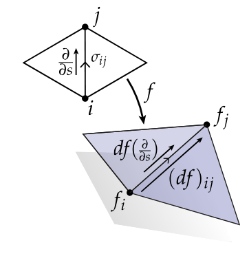
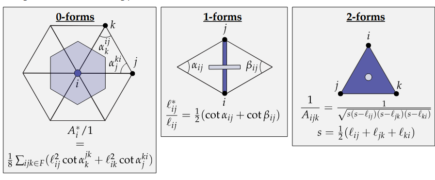

# Discrete Surfaces

## Simplciial Surfaces

In the discrete case we will be working on **simplicial surfaces**, usually triangle meshes. 

In the same way that we defined some regularity conditions that make our surfaces "nice" in the smooth setting, we will also have some conditions that make our meshes easier to work with. 

Analogous to manifolds in the smooth setting, we can impose some intrinsic prerequisites on our mesh to make it manifold. Namely:
- highest degree simplicies are triangles
- every edge is contained exactly in two triangles. (no weird intersections)
- every vertex is contained in a single edge-connected cycle of triangles
(this prevents single points where multiples parts of the mesh degenerate to)

We will denote **abstract simplicial** surfaces as:
$$K = (V, E, F)$$ where $K$ is the mesh (komplex), $V$ is the list of vertices, $E$ is a list of edges, and $F$ is a list of faces.

## Simplicial Maps

Notice how this definition does not yet include any position information, it only encodes connectivity of a mesh. To place the abstract simplicial surface into space we will use a **simplicial map** that assigns coordinates $f_i$ to each vertex $v_i$ in $V$. To get the position between any set of 3 vertices we can use barycentric coordinates to linearly interpolate between them to fill in the triangles. A simplicial map must also map vertices of shared edges to the same position in space to properly glue them together.

## Discrete Differential 

A **discrete differential** $df$ is just the discrete exterior derivative of $f$, which is just a single value per oriented edge. We can derive thsi in fancy calculus ways by saying that the discrete diffeerential $df$ in the edge $ij$
$$(df)_{ij} := \int_{ij}df(\frac{d}{ds})ds = \int_{ij}df = \int_{\partial ij}f = f(j) - f(i)$$
All that math just to derive that the discrete derivative is the difference between two vertices aka the edge vector of the mesh.

Now that we have defined the discrete differential lets define a discrete version of immersion. 

## Simplicial Immersion

Remember that in the smooth case a parametrized surface $f$ is an immersion if its differential is nondegenerate i.e. $df(X)=0$ iff. $X=0$.
In the discrete case the obvious version of this condition is that the edge vector between two points never becomes 0 under a simplicial map. The issue is this definition of the condition can lead to self intersections (which is fine for immersions) but also leads to branch points. 

Instead we will use a condition that better captures a more basic property of smooth immersions: local injectivity, i.e. around any point on the domain there is a sufficiently small neighborhood around that point that when mapped into space remains injective. So we will define **simplical immersions** as a locally injective simplicial map. In the discrete case that just means that no two vertices in the domain can be mapped onto the same position in space. 

## Discrete Gauss Map

For discrete simplicial immersions the Gauss map is just the triangle face normals. 

## Discrete Vector Area

As defined above the discrete Gauss map inly defines normals at faces, to find normals at vertices or even at a collection of faces we will first have to consider the **discrete vector area**. Recall that the smooth vector area:
$$\int_{\Omega}NdA = \frac{1}{2}\int_{\Omega}df \wedge df = \frac{1}{2}\int_{\partial \Omega} f \times df$$

The property of the vector area defined above which expresses that the smooth vector area can be defined just in terms of the boundary will transfer nicely to the discrete case since the boundary of a triangle or a set of faces is just the edges that bound that area.

In the discrete setting, this boundary integral becomes a sum over oriented boundary edges. For a whole patch $\Omega$, the discrete vector area is

$$\vec A_{\Omega}=\frac12 \sum_{ij \in \partial \Omega} f_i \times f_j$$

This gives the total area-weighted normal of the patch.

However, if we want a normal at a vertex $p$, we integrate over the dual cell associated with $p$. For the barycentric dual cell, each incident triangle contributes one third of its area vector to each of its three vertices. Therefore,

$$ \vec A_p = \frac13 \vec A_{\Omega}$$

Using the boundary formula for $\vec A_{\Omega}$, we get

$$ \vec A_p = \frac13 \int_{\Omega} N\,dA = \frac16 \int_{\partial \Omega} f \times df$$

On a discrete boundary edge $e_{ij}$, the map $f$ is linear, so

$$
\int_{e_{ij}} f \times df
=
\frac{f_i + f_j}{2}
\times
(f_j - f_i)
=
f_i \times f_j.
$$

Therefore the discrete vertex vector area is

$$
\boxed{
\vec A_p
=
\frac16
\sum_{ij \in \partial \Omega}
f_i \times f_j
}
$$

where $\partial \Omega$ is the oriented boundary of the one-ring region around $p$.

Finally, the vertex normal is obtained by normalizing this vector area:

$$N_p = \frac{\vec A_p}{\|\vec A_p\|}$$

The factor $\frac12$ belongs to the vector area of a full patch. The factor $\frac16$ appears for vertex normals because we first take one third of the surrounding patch’s vector area.

This definition is pretty nice but it is kinda strange that it does not depend on the exact position of the point $p$ in space only on the edge lengths of its boundary and not the exact position of $p$ within that boundary. 

Another definition for normals is to just use **area-weighted vertex normals**.
$$\sum_{ijk}A_{ijk}N_{ijk}$$
this corresponds to teh exact volume variation.

## Hodge Star Surfaces

The discretized Hodge star is a diagonal matrix storing primal-dual volume ratios.

In the discrete plane:

Since triangles are flat surfaces we don't need to do much in the curved case except "flatten" out the bent triangles into a sheet and so we can keep our old definition of the Hodge star. 

## Laplace-Beltrami Operator

