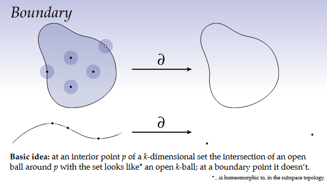
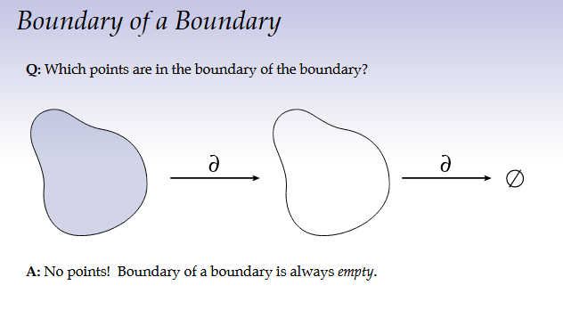

# Lecture 7: Integration

## Overview: Integration and Differentiation

### Fundamental Theorem of Calculus

If you have a differentiable scalar function $\phi$ on an interval $[a, b]$, the integral of its derivative over the interval is equal to the difference of the function's values at the endpoints:

$$\int_{a}^{b} \frac{\partial\phi}{\partial x} dx = \phi(b) - \phi(a)$$

What this theorem is saying for the 1D case is that if you sum up all the little differences in the function over a certain domain those little differences must add up to the overall change in the function over that domain. 

**Goal:** Extend this concepts to differential forms to build Discrete Exterior Calculus (DEC).
* Differentiation $\rightarrow$ Exterior Derivative ($d$)
* Integration $\rightarrow$ Integration of $k$-forms
We will do this by using **Stokes' Theorem** which generalizes the fundamental theorem of calculus to k-forms.

---

## Integration of Differential Forms

### Intuition: Riemann Sums
Integration is fundamentally about chopping a domain $\Omega$ into small pieces ($A_i$), measuring each piece, and summing the results.
* **Area Integration:** Summing the areas of the blocks: $\sum A_i \to \int_\Omega dA$.
* **Scalar Function Integration (0-forms):** We weight the area of each block by the function value at a point $p_i$:
    $$\sum A_i \phi(p_i) \to \int_\Omega \phi \, dA$$
   

### Integration of a $k$-Form
Since $k$-forms are "rulers" that measure $k$-dimensional volume, integration is their natural operation. To integrate a $k$-form $\omega$ over a domain $\Omega$, we feed it the vectors defining the local volume element.

For a 2-form $\omega$ in a 2D region (plugging in tangent vectors $u_i, v_i$):
$$\sum_i \omega_{p_i}(u_i, v_i) \to \int_\Omega \omega$$

**Key Insight:** Integration *always* involves differential forms. When you write $\int f(x) dx$, the $f(x)dx$ is technically a 1-form.

### Example: Integration on Curves (1-forms)
Given a curve $\gamma$ and a 1-form $\alpha$:
1.  **Integrating $\alpha$:** Measures how much the curve "lines up" with the 1-form (tangential flow).
    $$\int_\gamma \alpha \approx \sum \alpha_{p_i}(T_i)$$
    where $T_i$ is the tangent vector.
2.  **Integrating $\star \alpha$ (Flux):** Measures the flow *through* the curve (normal flow).
    $$\int_\gamma \star \alpha \approx \sum \alpha_{p_i}(N_i)$$
    where $N_i$ is the normal vector (tangent rotated 90°).

**Example (Unit Circle):**
Integrating $\alpha = dy$ over the unit circle:
$$\int_{S^1} dy = 0$$
Geometrically, for every point with tangent $T$, there is an opposite point with tangent $-T$. The vertical components cancel out perfectly.

---

## Stokes' Theorem

Stokes' Theorem is the central pillar of exterior calculus, generalizing the Fundamental Theorem of Calculus, Divergence Theorem, and Green's Theorem.

### The Theorem
For a differential $(n-1)$-form $\alpha$ on an $n$-dimensional domain $\Omega$:
$$\int_\Omega d\alpha = \int_{\partial\Omega} \alpha$$

The integral of the derivative over the interior equals the integral of the function over the boundary.

Think of a pool with sinks, generators, eddies, currents, etc that cause some change in the water over the area of the pool. Stoke's theorem basically says that if you integrate (sum up) all those little currents over the area of the pool that will equal to the amount of water along the sides of the pool. Since water is not compressible every little change inside the pool, no matter how complex, is ultimately captured by the water along the boundary of the pool. Almost like an implicit conservation of energy or "The change we see on the outside is
purely a function of the change within.” - Zen koan (paradoxical Chinese Chan Buddhist statement, meant to provoke insight)

### The Boundary Operator ($\partial$)
* The boundary $\partial \Omega$ consists of points where the local neighborhood does not look like an open ball.

* **Boundary of a Boundary:** The boundary of a boundary is always empty.
    $$\partial \circ \partial = \emptyset$$

### Special Cases of Stokes' Theorem

1.  **Fundamental Theorem of Calculus:**
    $$\int_a^b \frac{\partial \phi}{\partial x} dx = \phi(b) - \phi(a) \iff \int_{[a,b]} d\phi = \int_{\partial[a,b]} \phi$$
    Here, the boundary of the interval $[a, b]$ is the set of points $\{a, b\}$ (with orientation signs).

2.  **Divergence Theorem ("What goes in must come out"):**
    $$\int_\Omega \nabla \cdot X \, dA = \int_{\partial\Omega} n \cdot X \, dl \iff \int_\Omega d(\star \alpha) = \int_{\partial\Omega} \star \alpha$$
    
3.  **Green's Theorem ("What goes around comes around"):**
    Relates the curl (vorticity) inside the region to the circulation along the boundary.
    $$\int_\Omega \nabla \times X \, dA = \int_{\partial\Omega} t \cdot X \, dl \iff \int_\Omega d\alpha = \int_{\partial\Omega} \alpha$$

### Why $d \circ d = 0$?
We can use Stokes' theorem to justify the exactness property of the exterior derivative.
$$\int_\Omega d(d\phi) = \int_{\partial\Omega} d\phi = \int_{\partial(\partial\Omega)} \phi = \int_\emptyset \phi = 0$$
Since this holds for *any* domain $\Omega$ (no matter how small), the integrand $d(d\phi)$ must be zero everywhere. Thus, **$d^2=0$ is a consequence of $\partial^2 = \emptyset$**.

---

## Inner Products on Differential Forms

To apply geometric notions (lengths, angles) to forms, we need an **inner product**.
The inner (dot) product of two vectors in Euclidean $R^n$ is just the sum of the product of the components. i.e. dot product between two vectors.
But technically the collection of functions are also vector spaces (real integrable functions on the unit square). So what does it mean to measure the inner product between functions?

### $L^2$ Inner Product

1.  **For Scalar Functions (0-forms):**
    Mimics the Euclidean dot product by integrating the product of values over the domain.
    $$\langle\langle f, g \rangle\rangle := \int_\Omega f(x)g(x) \, dA$$

In general:

2.  **For $k$-forms:**
    We need an integrand that is a top-level $n$-form (volume form). We use the Hodge Star to convert one $k$-form into an $(n-k)$-form so it can be wedged with the other $k$-form to produce an $n$-form.
    $$\langle\langle \alpha, \beta \rangle\rangle := \int_\Omega \star \alpha \wedge \beta$$
    *(Note: Order matters for sign convention. Here $\star \alpha$ is used).*

### Geometric Interpretation
This inner product measures how well two forms "line up" globally over the domain.
* If $\alpha$ and $\beta$ are orthogonal everywhere, $\langle\langle \alpha, \beta \rangle\rangle = 0$.
* This definition is crucial for defining the **codifferential** $\delta$ and the **Laplacian** in curved spaces.

---

## Summary
* **Integration** breaks a domain into pieces and measures them using $k$-forms.
* **Stokes' Theorem** ($\int_\Omega d\alpha = \int_{\partial\Omega} \alpha$) connects integration and differentiation, allowing us to convert region integrals to boundary integrals.
* **Inner Products** on forms ($\int \star \alpha \wedge \beta$) allow us to measure geometric alignment and magnitude of forms globally.
* **Next Steps:** Apply these continuous concepts to meshes (Simplicial Complexes) to create **Discrete Exterior Calculus**.
