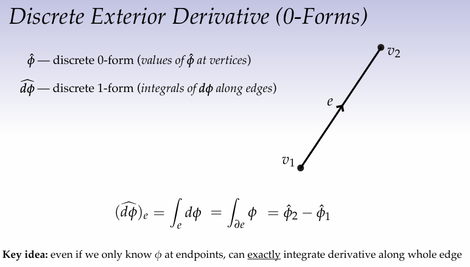
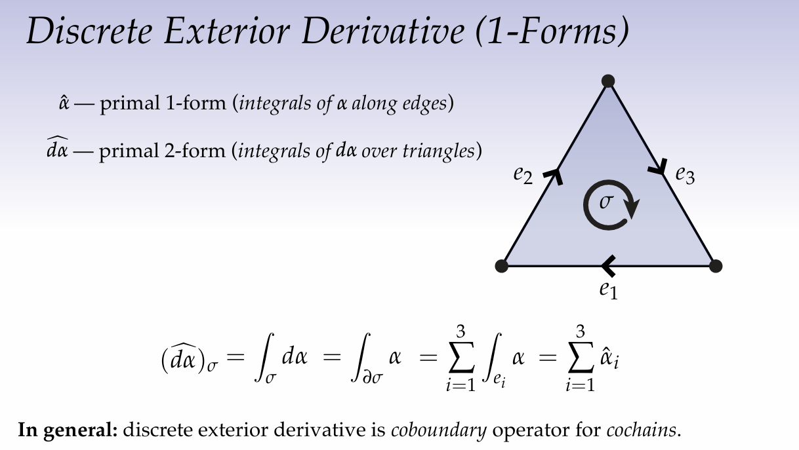
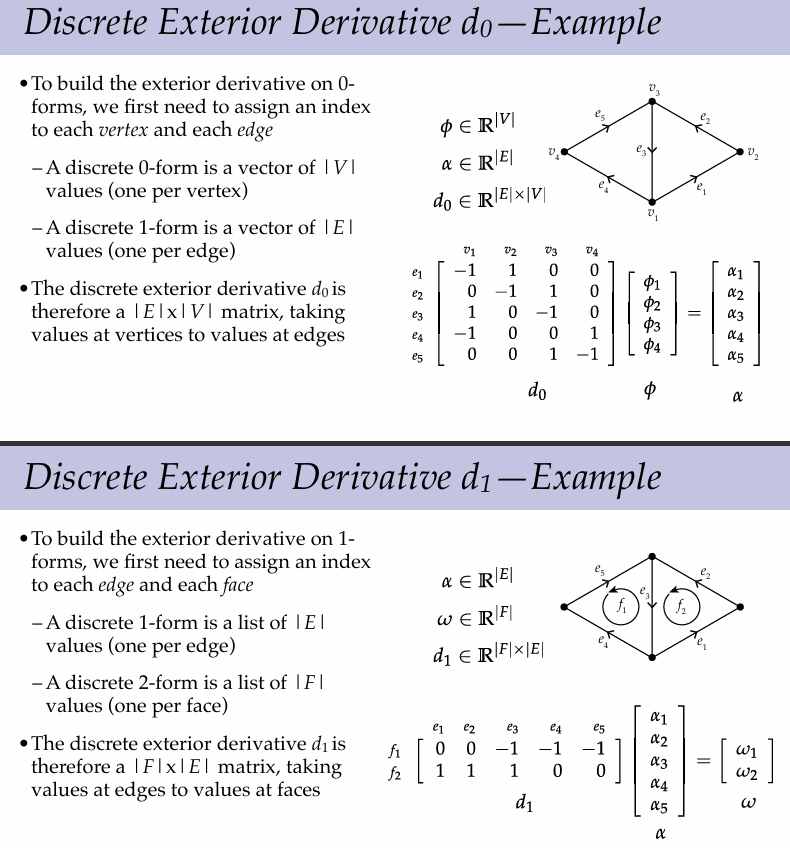
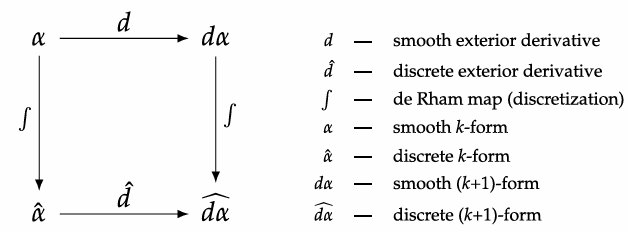
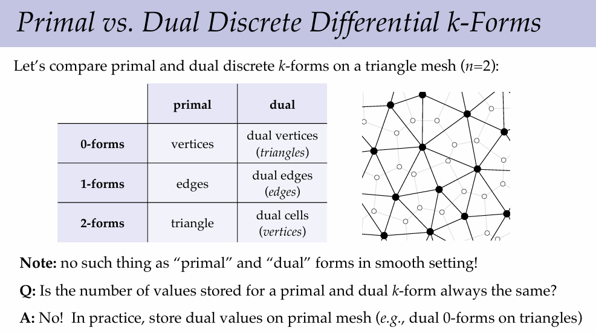
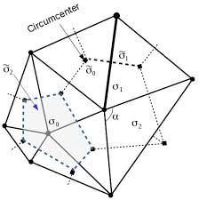

# Lecture 9 Discrete Exterior Calculus

## Continuos Exterior Derivative    

### Recap

Recall, in the continuous or smooth setting the exterior derivative maps a differential k-form to a differential (k+1)-forms.
With the properties that:
 - $d(\alpha \wedge \beta = d\alpha \wedge \beta + (-1)^k \alpha \wedge d \beta)$
 - $ d^2 = 0$ aka yields zero when applied twice  

These properties can be derived from Stokes Theorem:  
$$\int_{\partial \Sigma}\omega = \int_{\Sigma} d \omega$$
where $\Sigma$ is a $(k+1)$-dimensional oriented region.  
Which basically states that the values on the boundary of the region added up equals the sum of the changes inside the entire region. Think of a pool of incompressible water, then all the little eddies and currents inside the pool equal to the overall force on the sides (boundary) of the pool.

Additionally, the exterior derivative is:
- similar to the gradient when applied to a 0-form. 
- similar to curl when applied to a 1-form
- similar to divergence when composed w/ Hodge star (of a 1-form)

## Discrete Exterior Derivative  

### In the discrete 0-form case we have:  
$\hat{\phi}$ is a discete 0-form which corresponds to values at vertices $v_1$ and $v_2$ of a line.  
$\hat{d \phi}$ which is a discrete 1-form created by the integral of $d\phi$ along the edge from $v_1$ to $v_2$.

So if we take the derivative of the continuous function $\phi$ and integrate along the edge what value $\hat{d \phi}$ would we get?

Well using the fundamental theorem of calculus or stokes theorem we can rewrite the integrals of $\hat{d \phi}$ along the edge as:
$$(\hat{d \phi})_e = \int_e d \phi = \int_{\partial e} \phi $$
Or in other words we can exchange the little derivatives of the function over the entire edge to just the value of the function at the boundary of the edge, aka at the start and end point of the edge ($v_1$ and $v_2$).

Thus $$(\hat{d \phi})_e = \hat{\phi}_2 - \hat{\phi}_1 = v_2 - v_1$$

### In the discrete 1-form case we have:  

Now we are working with a discrete triangle $\sigma$ with oriented edges $e_1 ... e_3$. We'll define $\hat{\alpha}$ as the discrete primal 1-form which is the integrals of $\alpha$ along the edges, and $\hat{d \alpha}$ as the discrete primal 2-form which is the integrals of $d \alpha$ over the triangle.

$$(\hat{d \alpha})_\sigma = \int_\sigma d \alpha = \int_{\partial \phi} \alpha$$
Since the boundary of a simplex in general is a collection of simplices, in this case the triangle is made up of edges (lines), thus we can split up the integral into piecewise functions along the simplices (edges) of the triangle. So:  
$$(\hat{d \alpha})_\sigma = \int_\sigma d \alpha = \int_{\partial \phi} \alpha = \sum_{i=1}^3 \int_{e_i}\alpha$$  
Once again the integral over an edge $e_i$ of $\alpha$ is just a discrete 1-form value $\hat{\alpha}_i$ so:

$$(\hat{d \alpha})_\sigma = \int_\sigma d \alpha = \int_{\partial \phi} \alpha = \sum_{i=1}^3 \int_{e_i}\alpha = \sum_{i=1}^3 \hat{\alpha}_i$$

In a more discrete vocabulary you can say that in general the discrete exterior derivative is the coboundary operator for cochains. 

It's worth pointing out that the exterior derivative is independent of geometry it is more of a topological measure meaning which is easy to see in the discrete case since the exterior derivatives only depend on the values at the vertices of a simplex rather than the area bounded by the simplex. But orientation of a simplex and it's simplices does matter.  

### Matrix Representation

The discrete exterior derivative on discrete k-forms, denoted by $d_k$, is a linear map from values on k-simplices to values on (k+1)-simplices.
Examples:
- $d_0$ maps values on vertices to values on edges
- $d_1$ maps values on edges to values on triangles
- $d_2$ maps values on triangles to values on tetrahedra
- ...
- stops as $k = n-1$ where $n$ is dimension

So we can encode this operation using a matrix by first assigning indices to mesh elements (edges, faces, volumes) and using signed incidence matrices to store the connection information of mesh elements. (This is a very sparse matrix for large meshes).

Example:

**$\star$ Exterior Derivative Commutes w/ Discretization**  
Taking the smooth exterior derivative and then discretizing yields the same result as discretizing and then applying the discrete exterior derivative. 

Note: Applying the discrete exterior derivative twice also leads to 0 similar to the smooth setting.

In short the discrete derivative of a simplex is just the sum of the discrete derivaties of its simplices which is just a difference in the case of discrete 0-forms.

## Discrete Dual Forms

To derive more discrete operations for discrete exterior calculus lets revisit dual forms. Poincare Duality states that given a primal k-form we can associate its dual k-form of a complementary dimension. 

For dual exterior derivatives we do the same summing up along the boundary as in the primal form. 

## Discrete Hodge Star

Reminder: a Hodge Star ($\star$) is similar to an orthogonal complement, in that the Hodge Star of a 2-form $u \wedge v$ is equal to its dual 1-vector $w$ aka $\star(u \wedge v) = w$. For the discrete Hodge star, we also need geometry (metric information), because the Hodge star converts between primal and dual measurements and introduces scale factors (volume/area/length ratios). There are many possible ways to place dual vertices on a simplex but a common choice is to use the circumcentric dual which is just the center of the smallest circle that passes through all the simplicies of the simplex. For example the circumcenter of a triangle is the point in the center of a circle which goes through all 3 of the triangle vertices. For an edge the circumcenter is just the middle of the edge and for a point its just the point itself. If I have 2 triangles that share and edge then to get the dual edge i can connect the two circumcenters of the two triangles. This causes the dual and primal edges to meet orthogonally. Note, the circumcenter of a simplex is not guaranteed to land inside the simplex, can yield negative signed length. 

### Discrete Hodge Star — Basic Idea

Consider a primal $k$-simplex $\sigma$ and its dual $(n-k)$-cell $\sigma^\star$.

If $\alpha$ is a smooth $k$-form, define:
$$\hat{\alpha} = \int_\sigma \alpha$$
and the corresponding dual value
$$\widehat{\star \alpha} = \int_{\sigma^\star} \star \alpha$$

Question: what is the relationship between these two integrals?

If $\alpha$ is approximately constant over the local region, then the two are related by a volume ratio:
$$\frac{\widehat{\star \alpha}}{\hat{\alpha}} \approx \frac{|\sigma^\star|}{|\sigma|}$$

So a natural discrete approximation is:
$$\widehat{\star \alpha} \approx \frac{|\sigma^\star|}{|\sigma|}\,\hat{\alpha}$$

Interpretation:
- $\hat{\alpha}$ is a primal measurement (e.g., circulation along an edge)
- $\widehat{\star \alpha}$ is the corresponding dual measurement (e.g., flux through a dual edge/cell)

This approximation becomes better when:
- $\alpha$ is smooth
- mesh elements are small

#### Example: Discrete Hodge Star on 1-forms in 2D

For a primal edge $\ell$ and its dual edge $\ell^\star$:
- primal 1-form value $\hat{\alpha}$ = circulation along $\ell$
- dual 1-form value $\widehat{\star \alpha}$ = flux through $\ell^\star$

The discrete Hodge star scales by the dual/primal length ratio:
$$\widehat{\star \alpha} = \frac{\ell^\star}{\ell}\,\hat{\alpha}$$

So in 2D, the Hodge star on primal 1-forms gives a dual 1-form.

#### Example: Discrete Hodge Star on 2-forms in 3D

For a primal triangle (area) and its dual edge (length), the Hodge star maps a primal 2-form to a dual 1-form by:
$$\widehat{\star \omega}_{ab} = \frac{\ell_{ab}}{A_{ijk}}\,\hat{\omega}_{ijk}$$
where:
- $A_{ijk}$ is the area of primal triangle $(i,j,k)$
- $\ell_{ab}$ is the length of the corresponding dual edge $(a,b)$

Again, it is always "multiply by dual volume, divide by primal volume."

### $\star$ Diagonal Hodge Star

Let $\Omega_k$ denote primal discrete $k$-forms and $\Omega^\star_{n-k}$ denote dual discrete $(n-k)$-forms on an $n$-dimensional simplicial manifold $M$.

The **diagonal Hodge star** is a map
$$\star : \Omega_k \to \Omega^\star_{n-k}$$
defined by
$$\widehat{\star \alpha}(\sigma^\star) = \frac{|\sigma^\star|}{|\sigma|}\,\hat{\alpha}(\sigma)$$
for each primal $k$-simplex $\sigma$ and corresponding dual $(n-k)$-cell $\sigma^\star$, where $|\cdot|$ denotes the appropriate measure (length/area/volume).

Key idea:
- **divide by primal volume**
- **multiply by dual volume**

This is called "diagonal" because each discrete value is scaled independently (no mixing between simplices).

### Matrix Representation of the Diagonal Hodge Star

Since the diagonal Hodge star on $k$-forms just multiplies each discrete $k$-form value by a constant volume ratio, it can be encoded as a diagonal matrix.

If $\sigma_1,\ldots,\sigma_N$ are primal $k$-simplices and $\sigma_1^\star,\ldots,\sigma_N^\star$ are corresponding dual $(n-k)$-cells, then:
$$
\star_k =
\begin{bmatrix}
\frac{|\sigma_1^\star|}{|\sigma_1|} & & 0 \\
& \ddots & \\
0 & & \frac{|\sigma_N^\star|}{|\sigma_N|}
\end{bmatrix}
\in \mathbb{R}^{N \times N}
$$

So:
- $\star_k$ is the matrix for Hodge star on primal $k$-forms
- it is diagonal (for the standard circumcentric DEC choice)

Building the Hodge star boils down to computing dual/primal volume ratios.In many common cases (especially circumcentric duals), these ratios have simple formulas in terms of lengths and angles, so we often do not need to explicitly compute circumcenters.

Example (2D circumcentric dual):
- dual edge lengths and dual cell areas can be written using cotangent expressions
- this leads to familiar cotangent weights in discrete geometry / DEC constructions

This is one reason the circumcentric dual is so common in practice.
