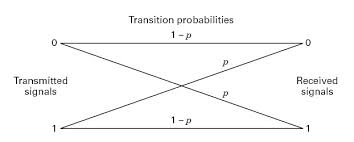

# Information Theory Lecture 1

Source Message (S) -> Encoder (E) -> coded transmission(t) -> Channel with some Noise -> Decoder

(put better diagram above)

## Toy Example:

Binary Symmetric Channel:

  
Input is 0 or 1 and we get back out 0 or 1. 

Probability of output (y) is same as input (x). 
- $P(y=0|x=0)=1-f$

Probability of output (y) is different than input (x). 
- $P(y=1|x=0)=f$

ie $f$ is flipping fraction. 

Q1: If we have N = 10,000, and f = 0.1 ie we run the channel 10000 times with a flipping chance of 10% roughly how many bits are flipped?

Since this follows the binomial distribution where:
- Mean = np
- Var = np(1-p)
- Standard Deviation = sqrt(Var) = sqrt(np(1-p))
Mean = 10,000 * 0.1 = 1000
Thus STD = $sqrt(10000*0.9*0.1)$ = 30
Thus range of flipped bits is 1000 +- 30

## Repetition Code

One way of making a signal more robust to noise is to simply repeat the signal an additional N number of times and then take a majority vote to decide what the signal most likely was.

Using bayes rule and the two fundamental rules of probability we can 
find the probability of $r=011$ if we meant to send 0 or 1, ie:
P(r|s=0) and P(r|s=1).

- P(r|s=0) two flips must have happened: $(1-f)*f*f$
- P(r|s=1) one flips must have happened: $f*(1-f)*(1-f)$

In general we can say $f^n(1-f)^{(N-n)}$ where n is the number of bits that would have been flipped and $N$ is the number of bits per packet.

Thus by bayes rule:
if P(s=0)=1/2 and P(s=1)=1/2:
$$P(s=1|r=011) = \frac{0.5(1-f)^2f}{0.5(1-f)f^2 + 0.5f(1-f)^2} = 1-f$$
which is equal to 0.9 which is greater than the other guess so the basic majority rule works mathematically. 

