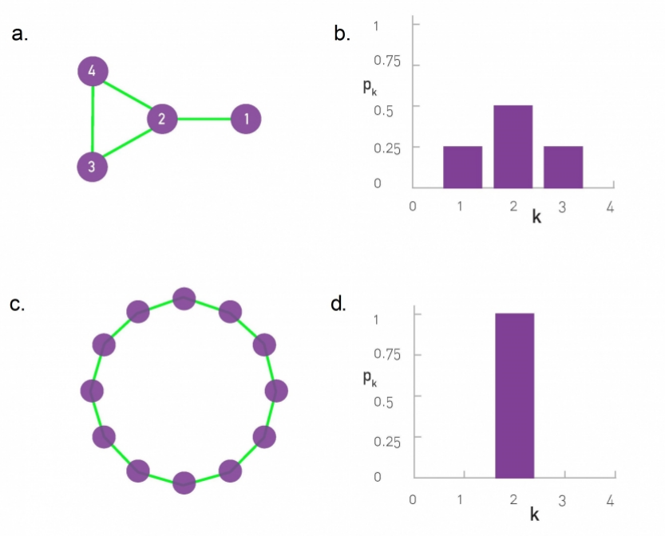
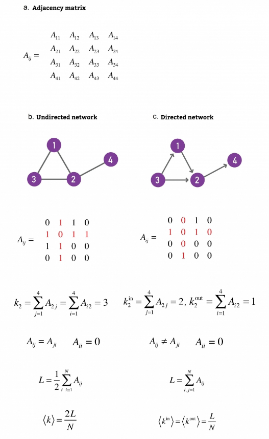
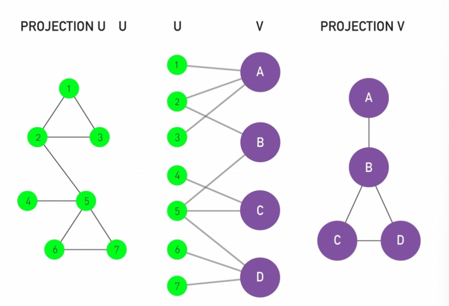
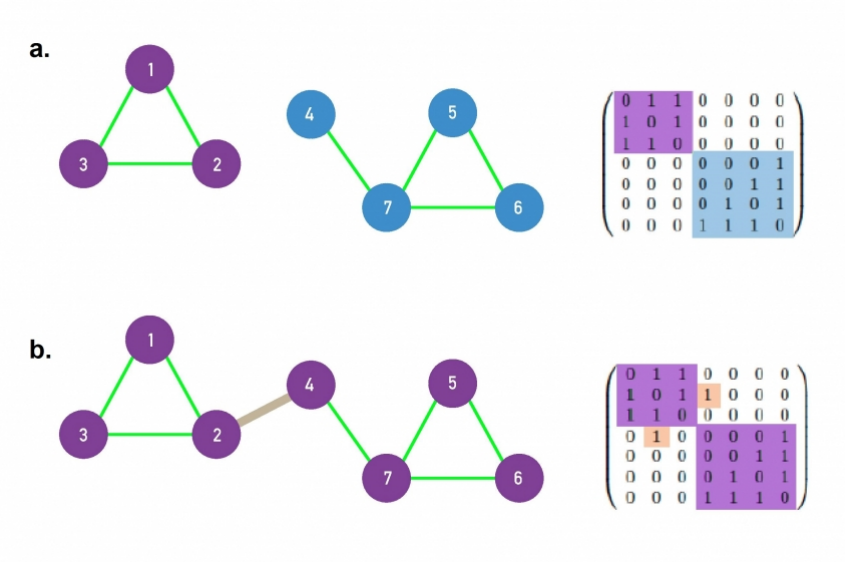

# Graph Theory

In this article I want to go over some of the simple concepts, definitions, and mathematical building blocks that will be used in my exploration of network science based on https://networksciencebook.com/chapter/2#networks-graphs and the Stanford course

# Networks and Graphs

## Basics

Networks are made up of nodes $n$ and edges $e$.
The number of nodes in a network $N$ is its size.
The number of links in a network $L$, represent the total number of edges between the nodes of the network.

Links or edges in a network can be directed or undirected. A network where all of its links are directed is called a **digraph** or a directed network and a network where all links are undirected is simply called an undirected network. Some networks may have both directed and undirected links. 

Note on terminology:
In network science we use the terms: network, node, and link which refer to graph, vertex, and edge, respectively in graph theory. The network science terminology refers more to real systems and I personally like it better so I will adopt it for the rest of the discussion in this domain. 

## Degree

The **degree** of a node is the number of link it has to other nodes i.e. its number of neighbors. The number of neighbors of the $i$th mode in the network is denoted as $k_i$. 

For undirected networks the total number of links $L$ is half the sum of all the node degrees. 
$$L = \frac{1}{2} \sum_{i=1}^N k_i$$

Since each link connects two nodes bidirectionally the half factor accounts for this double counting. 

### Average Degree

The average degree of an undirected network is:
$$k_{avg} = \frac{1}{N} \sum_{i=1}^N k_i = \frac{2L}{N}$$

For directed networks the degree of a node is the sum of all its outgoing and incoming links $k_i = k_i^{in} + k_i^{out}$.
Then the total number of links in a directed network is:
$$L = \sum_{i=1}^N k_i^{in} = \sum_{i=1}^N k_i^{out}$$
Since for each node its outgoing link points to another node which regards that link as an incoming node. 
The average degree of a directed network is:
$$k_{avg}^{in} =  \frac{1}{N} \sum_{i=1}^N k_i^{in} = k_{avg}^{out} = \frac{1}{N} \sum_{i=1}^N k_i^{out} = \frac{L}{N}$$

Ok so now we have some local idea of the degree of a node and some global idea about the average connectivity of the network. 

### Degree Distribution

The **degree distribution** $p_k$ is the probability that a randomly selected node in the network has degree $k$. Since $p_k$ is a probability it must be normalized:
$$\sum_{i=1}^\infty p_k = 1$$
In other words the sum of the probability of picking all the nodes with any number of connectivity must be 1 since if we pick all the available nodes then that has the probability 1. 

For a network with $N$ nodes the degree distribution is just the number of degree-k nodes divided by the total number of nodes. 
$$p_k = \frac{N_k}{N}$$ thus we can say that the number of k-degree nodes in the network is just the number of nodes times the probability of picked a k-degree node $$N_k = N p_k$$

The average degree of a network can be written as:  
$$k_{avg} = \sum_{k=0}^\infty k p_k$$ which can be read as the average degree of a network is the sum of all the possible degrees $k$ times its probability $p_k$.

The degree distribution is extremely useful as it determines many network phenomena. 

## Adjacency Matrix

An adjacency matrix of a network encodes the links between nodes as a matrix. For a network with N nodes an N by N adjacency matrix can be used to represent the connection by marking linked nodes with 1 in the matrix. $A_{ij} = 1$ if there is a link pointing from node $j$ to node $i$ and $0$ otherwise.

For undirected networks since 2 nodes are linked by the same edge $A_{ij} = A_{ji}$. 

The degree $k_i$ of node $i$ can be directly obtained from the elements of the adjacency matrix. For undirected networks, a node's degree is a sum over either the rows or the columns of the matrix, i.e.,

$$k_i = \sum_{j=1}^N A_{ij} = \sum_{j=1}^N A_{ji}$$

For directed networks, the sums over the adjacency matrix's rows and columns provide the incoming and outgoing degrees, respectively:

$$k_i^{in} = \sum_{j=1}^N A_{ij}, \quad k_i^{out} = \sum_{j=1}^N A_{ji} \quad$$

Given that in a undirected network the total number of outgoing links equals the total number of incoming links, we have:

$$2L = \sum_{i=1}^N k_i^{in} = \sum_{i=1}^N k_i^{out} = \sum_{i,j=1}^N A_{ij}$$

As we can see the values along the diagonal are always zero unless there is a link from a node pointing back to itself. 

The issue with adjacency matrices is that real networks are sparse so we are wasting a lot of memory storing 0s. The number of links $L$ in an $N$ node network can vary wildly between $L = 0$ to $L_{max} = \frac{N}{2} = \frac{N(N-1)}{2}$ since we can have no connections between any node or all nodes are connected to every other node. So more formally a network is sparse if $L << L_{max}$. 

## Weighted Networks

Weighted networks have some weight $w_{ij}$ associated with the link(i, j). 

> ### Metcalfe's Law
>
>Metcalfe's Law states that the "value" of a network is proportional to >the square of the number of nodes in the network $N^2$. But in real >networks not every node connects to every other node, the netwrok is >sparse aand not all links in the network are equally weighted, some >nodes are used heavily while the vast majority are rarely used. 

## Bipartite Networks

Bipartite graphs or bigraphs are networks where you can divide the nodes into two disjoint sets U and V such that every node in U is never directly connected to any other node in U but rather has to go through exactly one node in V to reach another node in U, and vice versa. An example of a bigraph is the actor network where the set of movie nodes only connect to actor nodes and actor nodes only connect to movie nodes, but by traversing the movie nodes shared between actors we can create a mapping of actors associated through their roles. This way we can create two additional networks which are the projections of the actor and movie nodes into their own networks. These projected networks show the connection between actors through movies and the connections between movies through the actors that played in them respectively. 

## Distances and Paths

In networks the concept of distance between two nodes is the number of link traversals it takes to get from node A to node B. There may be many paths that go from node A to node B but there will always be a shortest and longest path (which may not be mutually exclusive). 

### Shortest Path

The shortest path (distance) from node $i$ to node $j$, $d_{ij}$ is the path(s) with the fewest number of links. By definition a shortest path can never contain loops since that loop can be removed from the path to still get to the same end point in less steps. In undirected networks $d_{ij} = d_{ji}$ but in undirected networks not only can $d_{ij} != d_{ji}$ but the existence of a path from node i to node j does not guarantee the existence of a path from j to i.

Some extra definitions / terminology:

>The **diameter** $d_{max}$ is the longest shortest path in a graph i.e. >the distance between the two furthest nodes in the graph. 

>The **average path length** $d_{avg}$ is the average of the shortest >paths between all pairs of nodes. 

>A **cycle** is a path with the same start and end node. 

>An **Eulerian path** is a path that traverses each link exactly once.

>A **Hamiltonian path** is a path that visits each node exactly once.

The number of shortest paths $N_{ij}$ between two nodes $i$ and $j$ and the length of that path $d_{ij}$ can be calculated from the adjacency matrix.

#### Number of Shortest Paths Between Two Nodes

>The number of shortest paths, $N_{ij}$, and the distance $d_{ij}$ >between nodes $i$ and $j$ can be calculated directly from the adjacency >matrix $A$.

>* **$d_{ij} = 1$:** If there is a direct link between $i$ and $j$, then >$A_{ij} = 1$ ($A_{ij} = 0$ otherwise).
>* **$d_{ij} = 2$:** If there is a path of length two between $i$ and >$j$, then $A_{ik} A_{kj} = 1$ ($A_{ik} A_{kj} = 0$ otherwise). The >total number of $d_{ij} = 2$ paths between $i$ and $j$ is calculated by >summing over all possible intermediate nodes $k$:
>$$N_{ij}^{(2)} = \sum_{k=1}^N A_{ik} A_{kj} = [A^2]_{ij}$$
>where $[...]_{ij}$ denotes the $(i,j)$th element of a matrix.
>* **$d_{ij} = d$:** If there is a path of length $d$ between $i$ and >$j$, then $A_{ik} \dots A_{lj} = 1$ ($A_{ik} \dots A_{lj} = 0$ >otherwise). The number of paths of length $d$ between $i$ and $j$ is >given by the $d$-th power of the adjacency matrix:
>$$N_{ij}^{(d)} = [A^d]_{ij}$$
>These equations hold for both directed and undirected networks. The >true shortest distance between nodes $i$ and $j$ is the path with the >smallest $d$ for which $N_{ij}^{(d)} > 0$. 

>Note: Despite the elegance of this linear algebra approach, when faced >with a large network, it is vastly more computationally efficient to >use a Breadth-First Search (BFS) algorithm to find shortest paths >rather than computing matrix powers.

### Average Path Length

The **average path length** $d_{avg}$ is the average of the distance between all pairs of nodes in the network. For directed networks it is:
$$d = \frac{1}{N(N-1)} \sum_{i,j=1, N;i!=j}d_{i,j}$$
In other words we sum up all the pairwise distances between nodes and divide by the total number of links in the network. 

## Breadth-First Search (BFS) Algorithm

The idea behind breadth first search is that we iteratively spread out from a starting node and explore each neighboring node at an ever increasing distance until there are no more neighbors to explore.

To find the shortest path between node $i$ and $j$ we can do
Pseudocode:
- start at node $i$, and label it with "0"
- find the neighbors (directly linked nodes) of $i$ abd label them distance "1" and put them in a FIFO queue. 
- take the first node from hte queue labeled "n" and find all its unlabeled neighbors, label them with "n+1" and put them in the queue.
- Repeat the previous step until node $j$ is reached or until there are no more nodes in the queue. 
- The distance between $i$ and $j$ is the label of $j$. If $j$ does not have a label then its unreachable i.e. distance = infinity. 

Time complexity is O(N + L) - nice and linear 

## Connectedness

A network is connected if all pairs of nodes in the network have a path between them with finite distance. A **component** is a subset of nodes in a networks, so that there is a path between any two nodes in the component. A **bridge** is any link that, if cut, disconnects a network i.e. creates a component. An adjacency matrix for a disconnected network can be rearranged into a block diagonal form, such that all nonzero elements in the matrix are contained in square blocks along the matrix’ diagonal and all other elements are zero.

In practice BFS can be used to identify components. 

Pseudocode:
- start from random node $i$ and perform BFS, label all nodes reached from $i$ with "1".
- If the total number of labeled nodes equals N, then the network is connected, if not the network must have more than one component.
- Increase the label by 1, choose an unmarked node, label it with the new label and use BFS to find all reachable nodes and also label them the same way. Return to the previous step.

## Clustering Coefficient

The clustering coefficient captures the degree to which the neighbors of a given node link to each other. For a node $i$ with degree $k_i$ (number of neighbors) the **local clustering coefficient** is:
$$C_i = \frac{2L_i}{k_i(k_i - 1)}$$
where $L_i$ is hte number of links between the $k_i$ neighbors of node $i$. 

In other words the clustering coefficient is the ration between the connectivity of the neighbors over the maximum possible connectivity of hte neighbors. 

- $C_i = 0$ if none of the neighbors of node i link to each other. 
- $C_i = 1$ if all neighbors of $i$ link to each other
- $C_i$ s the probability that two neighbors of a node link to each other. Consequently C = 0.5 implies that there is a 50% chance that two neighbors of a node are linked. 

The **avergae clustering coefficient** represents the degre of clustering of an entire network or component and is simply the average of $C_i$ over all nodes $i=0 ... N$ in the network / cluster.

$$C_{avg} = \frac{1}{N} \sum_{i=1}^N C_i$$

The clustering coefficient can be generalized to directed and weighted networks as well. 
