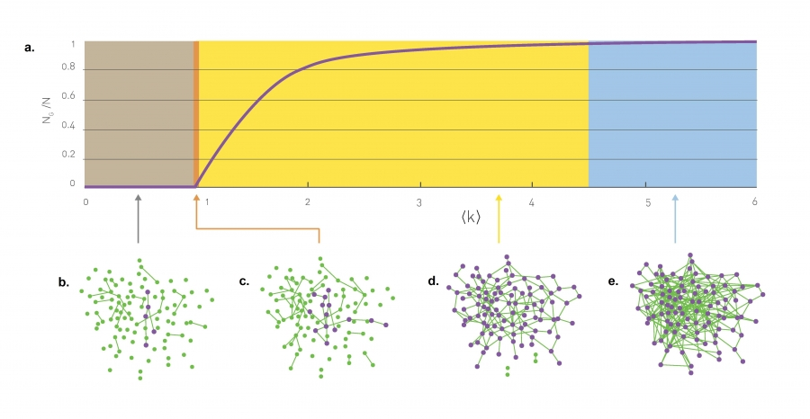
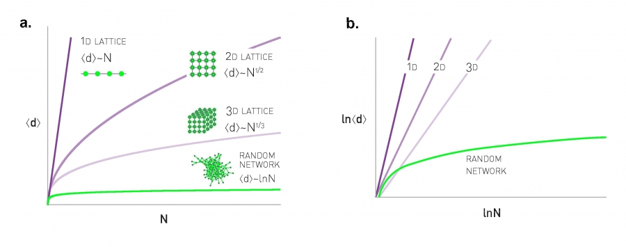

# Random Networks

## Definition

A random network consists of N nodes where each node pair is connected with probability $p$.

We can define random networks through two lens: through the probability $p$ of two nodes being connected or through saying out of N nodes there are L random connections. 

$G(N,L)$ Model: Has N nodes with L random connections.
$G(N,p)$ Model: Has N nodes with probability $p$ of two nodes being connected.

To construct a random network we follow these steps:
- Start with N isolated nodes.
- Select a node pair and generate a random number between 0 and 1. If the number exceeds p, connect the selected node pair with a link, otherwise leave them disconnected.
- Repeat step (2) for each of the N(N-1)/2 node pairs.

## Number of Links

The average number of links in a random network is:
$$L_{avg} = p\frac{N(N-1)}{2} = pL_{max}$$

Thus the average degree of a random networks is:
$$k_{avg} = \frac{2L_{avg}}{N} = p(N-1)$$

More precisely, the probability that a random network has exactly $L$ links is the product of three terms:

1. The probability that $L$ of the attempts to connect the $\frac{N(N-1)}{2}$ pairs of nodes have resulted in a link, which is $p^L$.

2. The probability that the remaining $\frac{N(N-1)}{2} - L$ attempts have not resulted in a link, which is $(1-p)^{\frac{N(N-1)}{2}-L}$.

3. A combinatorial factor, $\binom{\frac{N(N-1)}{2}}{L}$, counting the number of different ways we can place $L$ links among $\frac{N(N-1)}{2}$ node pairs.

We can therefore write the probability that a particular realization of a random network has exactly $L$ links as
$$p_L = \binom{\frac{N(N-1)}{2}}{L} p^L (1-p)^{\frac{N(N-1)}{2}-L}$$

## Degree Distribution

Degree distribution $p_k$ is the probability that a randomly chosen node has degree $k$ in a random graph.

In practice we use Poisson distribution to approximate $p_k$ since the distribution approximates a binomial distribution when networks are sparse, which is usually the case.
$$p_k = e^{k_{avg}}\frac{k_{avg}^k}{k!}$$

Conceptually, many large random networks have most nodes with degrees in narrow vicinity to $k_{avg}$ due to the property that highly connected nodes connect a lot of other nodes which then gain connection from those highly connected nodes making them in turn also well connected, thus we would not expect large numbers of outliers in real networks i.e. superpopular chads vs loners. 

But this is false, in the real world there is a much larger range of connectivity due to how random networks evolve in time.

## Evolution of Random Networks

Random networks evolve over time as the number of connections grow gradually, the size of the largest cluster $N_G$ does not grow gradually rather once the average degree of nodes reaches a critical value, which is dependent on $p$, then we expect rapid emergence of large clusters. 

The condition necessary for the emergence of a giant component has been proven to be:
$$k_{avg} = 1$$ a.k.a. we have a giant component if and only if each node has on average more than one connection / link. In terms of critical mass $p$:
$$p_c = \frac{1}{N-1}=1/N$$
Thus, for large networks the minimum probability of connection needed for a large cluster decreases as the number of nodes grows. 

The main takeaway is that for $p<1/N$ the size of the largest cluster is vanishingly small compared to the number of total nodes in the network $N_G/N => 0$. At the critical point $p=1/N$ i.e. $k_{avg}=1$ the relative size of the largest component is still zero but in absolute terms the size of the largest component jumps at $k_{avg}=1$. 

Many properties of the network at the critical point resemble the properties of a physical system undergoing a phase transition 

When $k_{avg}=lnN$ we enter the connected regime where the giant components start absorbing all nodes and components, note, when we enter hte connected regime hte networks is still relatively sparse as $lnN/N -> 0$ for large N. The network turns into a complete graph only at $k_{avg}=N-1$

$\bigstar$
- Once the average degree exceeds $k_{avg} = 1$, a giant component should emerge that contains a finite fraction of all nodes. Hence only for $k_{avg} > 1$ the nodes organize themselves into a recognizable network.
- For $k_{avg} > lnN$ all components are absorbed by the giant component, resulting in a single connected network.

## Real networks are supercritical

The main takeaway is that while real networks have $k_{avg} > 1 > ln(N)$ 
we don't actually see nodes being absorbed into one large cluster rather we see many different clusters of different sizes that may be still be overall connected through some edges.

## Small worlds phenomenon

The average distance between two nodes in a random graph is relatively "small":

$$d_{avg} = \frac{ln(N)}{ln(k_{avg})}$$

By small in the "small world phenomenon" we mean that the average path length or the diameter depends logarithmically on the system size. Hence, “small” means that $d_{avg}$ is proportional to $lnN$, rather than $N$ or some power of $N$.

## Local Clustering Coefficient
