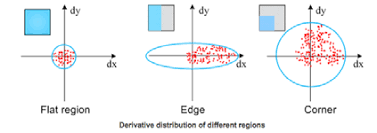
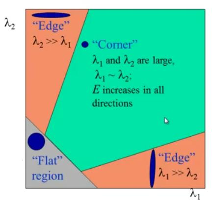

# Edge Detection

## Kernel Convolution

The idea behind kernel convolution is that we can define a kernel window of some size $n \times m$, where often $m=n$, and assign a multiplicative weight to each value in the kernel. If we place this kernel on an image, the pixels covered by the kernel are multiplied by the corresponding weights, and then we sum all of those products to produce a single output value. Kernel convolution can be thought of as a "spatial" dot product that computes a weighted sum over a local neighborhood of pixels (and if the kernel weights are normalized, this can act like a weighted average). 

Depending on how far we move the kernel over the image in the $x$ and $y$ directions at each step (the **stride**), we can reduce the spatial size of the output, since each kernel application maps an $n \times n$ region to one output value. If we have a **stride** of 1 (i.e., we move the kernel one pixel at a time) and use **no padding**, then the pixels at the edges are not fully covered by the kernel and the output image becomes smaller than the input. In general, the higher the stride, the smaller the output image becomes. If we want to produce an image the same size as the input image, we can use **padding** (typically zero-padding), adding a pixel with some value, around the border of the input so the kernel can still be centered on edge pixels.  

For an input of size $H \times W$, kernel size $K_h \times K_w$, padding $P_h, P_w$, and stride $S_h, S_w$:

$$H_{\text{out}} = \left\lfloor \frac{H + 2P_h - K_h}{S_h} \right\rfloor + 1$$

$$W_{\text{out}} = \left\lfloor \frac{W + 2P_w - K_w}{S_w} \right\rfloor + 1$$

So with a 3 by 3 kernel with stride of 1 and padding of 1 the output dimensions will be the same as the input dimensions.

## Blur

If we assign the multiplicative weights in the kernel based on a 2D Gaussian distribution centered in the middle of the kernel, we can achieve a smooth blurring effect. The key idea is that pixels closer to the center of the kernel contribute more to the output, while pixels farther away contribute less.

A continuous 2D Gaussian centered at $(\mu_x,\mu_y)$ is given by:

$$
G(x,y) = \frac{1}{2\pi\sigma_x\sigma_y}
\exp\left(-\left(\frac{(x-\mu_x)^2}{2\sigma_x^2} + \frac{(y-\mu_y)^2}{2\sigma_y^2}\right)\right)
$$

A common special case is the **isotropic Gaussian**, where $\sigma_x=\sigma_y=\sigma$:

$$G(x,y) = \frac{1}{2\pi\sigma^2}\exp\left(-\frac{x^2+y^2}{2\sigma^2}\right)$$

When building a Gaussian blur kernel for an $n \times n$ filter (usually with odd $n$ so there is a clear center), we sample this function at discrete grid locations around the center. For example, for a kernel centered at $(0,0)$ with radius $r=\frac{n-1}{2}$, we assign each kernel entry:

$$K[i,j] = G(i,j), \qquad i,j \in \{-r,\dots,r\}$$

where $(i,j)=(0,0)$ is the center of the kernel.

### Unnormalized Gaussian kernel values

If we use the Gaussian values directly, the kernel entries are:

$$K_{\text{raw}}[i,j] = \exp\left(-\frac{i^2+j^2}{2\sigma^2}\right)$$

or equivalently (including the Gaussian normalization constant),

$$K_{\text{raw}}[i,j] =\frac{1}{2\pi\sigma^2}\exp\left(-\frac{i^2+j^2}{2\sigma^2}\right)$$

Both forms have the same *shape*; they differ only by a constant scaling factor. In practice, many implementations omit the $\frac{1}{2\pi\sigma^2}$ term when constructing the kernel because the kernel is usually normalized afterward anyway.

### Normalized Gaussian kernel values

To preserve overall image brightness, we typically normalize the kernel so that all weights sum to 1. If $K_{\text{raw}}$ contains the sampled Gaussian values, then:

$$S = \sum_{i=-r}^{r}\sum_{j=-r}^{r} K_{\text{raw}}[i,j]$$
and the normalized kernel is:
$$K[i,j] = \frac{K_{\text{raw}}[i,j]}{S}$$

This ensures:
$$\sum_{i=-r}^{r}\sum_{j=-r}^{r} K[i,j] = 1$$

so the blur behaves like a weighted average and does not systematically brighten or darken the image.

### Applying the Gaussian kernel

Given an input image $I$, the blurred output at pixel $(x,y)$ is computed by sliding the kernel over the image and taking the weighted sum:

$$I_{\text{blur}}(x,y) =\sum_{i=-r}^{r}\sum_{j=-r}^{r} K[i,j]\; I(x+i,y+j)$$

(assuming appropriate padding / boundary handling).

### Intuition for $\sigma$

The parameter $\sigma$, standard deviation, controls how spread out the blur is:

- **Small $\sigma$**: weights are concentrated near the center causing a weaker blur
- **Large $\sigma$**: weights spread farther out causing a stronger blur

In practice, the kernel size $n$ is chosen large enough to capture most of the Gaussian mass (often a radius of about $3\sigma$ is used as a rule of thumb).

## Edge Detection

First, lets define what we mean by an edge. Edges have a very intuitive "I know it when I see it" feel to them, but it can be useful to enumerate the situations where we expect to place an edge. In general, any place in the image that has a "rapid" change in intensity caused by:
- surface normal discontinuity
- depth discontinuity
- surface reflectance discontinuity
- illumination discontinuity

should elicit an edge.

Furthermore, each edge should have an associated position, magnitude, and orientation that we also wish to identify with high detection rate, good localization, and low noise sensitivity.

Since we are concerned with areas of rapid change, the gradient operator is an obvious choice to find these areas. In 2D, the partial derivatives with respect to each dimension measure how quickly intensity changes in that direction. If $I(x,y)$ is the image intensity function, then the image gradient is

$$\nabla I(x,y) =
\begin{bmatrix}
\frac{\partial I}{\partial x} \\
\frac{\partial I}{\partial y}
\end{bmatrix}
=
\begin{bmatrix}
I_x \\
I_y
\end{bmatrix}
$$

We can find the magnitude of the gradient by:

$$\left\lVert \nabla I(x,y) \right\rVert=
\sqrt{\left(\frac{\partial I}{\partial x}\right)^2 + \left(\frac{\partial I}{\partial y}\right)^2}
=\sqrt{I_x^2 + I_y^2}
$$
This gradient magnitude is large where the image intensity changes rapidly, so it is a natural measure of edge strength.

Since the gradient in 2D can be decomposed into its $x$ and $y$ components, we can also find the gradient orientation (which points in the direction of maximum increase in intensity, i.e. **normal to the edge**) by:

$$\theta(x,y) = \operatorname{atan2}\!\left(I_y, I_x\right)=\operatorname{atan2}\!\left(\frac{\partial I}{\partial y}, \frac{\partial I}{\partial x}\right)$$

Note that the **edge direction** itself is tangent to the edge, so it is perpendicular to the gradient direction. Therefore, an edge tangent orientation can be written as:
$$\theta_{\text{edge}} = \theta + \frac{\pi}{2}\quad(\text{mod } \pi)$$

For a discrete image $I[x,y]$, we approximate the partial derivatives using finite differences. A simple forward-difference approximation is:

$$I_x[x,y] \approx I[x+1,y] - I[x,y]$$
$$I_y[x,y] \approx I[x,y+1] - I[x,y]$$
A common and often better approximation is the central-difference form:

$$I_x[x,y] \approx \frac{I[x+1,y] - I[x-1,y]}{2}$$
$$I_y[x,y] \approx \frac{I[x,y+1] - I[x,y-1]}{2}$$
Then the discrete gradient vector is:
$$
\nabla I[x,y] =
\begin{bmatrix}
I_x[x,y] \\
I_y[x,y]
\end{bmatrix}
$$
and its magnitude is:
$$
\left\|\nabla I[x,y]\right\|=
\sqrt{I_x[x,y]^2 + I_y[x,y]^2}
$$
with orientation (normal to the edge) given by:
$$\theta[x,y] = \operatorname{atan2}\!\left(I_y[x,y],\, I_x[x,y]\right)$$

Additionally, we can alo use the piecewise derivative of the gradient, aka the second derivative of the pixels values for edge detection. The Laplacian is the sum of the derivative of the gradient:
$$
\nabla^2 I(x,y)=\nabla\cdot(\nabla I)=\frac{\partial^2 I}{\partial x^2}+\frac{\partial^2 I}{\partial y^2}
$$
and is equal to 0 at the edges since the gradient at the peaks of the gradient is near 0. More precisely, edges are often detected at **zero-crossings** of the Laplacian (where $\nabla^2 I$ changes sign), which typically occur near locations of rapid intensity change. Unlike the gradient the laplacian is only a single scalar value with no information about orientation. In the discrete case since we are interested in the difference of differences we need at least 3 values to consider.

For example, 1D second differences can be approximated by:
$$
\frac{\partial^2 I}{\partial x^2}\Big|_{[x,y]} \approx I[x+1,y]-2I[x,y]+I[x-1,y]
$$
$$
\frac{\partial^2 I}{\partial y^2}\Big|_{[x,y]} \approx I[x,y+1]-2I[x,y]+I[x,y-1]
$$
so the discrete Laplacian becomes:
$$
\nabla^2 I[x,y] \approx I[x+1,y]+I[x-1,y]+I[x,y+1]+I[x,y-1]-4I[x,y]
$$

A practical note: because second derivatives amplify noise even more than first derivatives, Laplacian-based edge detection is usually preceded by smoothing (e.g. Gaussian blur), leading to the **Laplacian of Gaussian (LoG)** method.

### Convolution-kernel form

These finite differences can also be written as convolutions. For example, central differences correspond to the 1D derivative kernels:  
$$\frac{\partial}{\partial x} \;\sim\; \frac{1}{2}\begin{bmatrix}-1 & 0 & 1\end{bmatrix}$$
$$\frac{\partial}{\partial y} \;\sim\; \frac{1}{2}\begin{bmatrix}-1 \\ 0 \\ 1\end{bmatrix}$$
So:
$$
I_x = I * \left(\frac{1}{2}\begin{bmatrix}-1 & 0 & 1\end{bmatrix}\right),
\qquad
I_y = I * \left(\frac{1}{2}\begin{bmatrix}-1 \\ 0 \\ 1\end{bmatrix}\right)
$$
where $*$ denotes convolution (or cross-correlation in many implementations).

The Laplacian can also be implemented as a convolutional mask. A common 4-neighbor discrete Laplacian kernel is:
$$
L_4=
\begin{bmatrix}
0 & 1 & 0\\
1 & -4 & 1\\
0 & 1 & 0
\end{bmatrix}
$$
so that:
$$
\nabla^2 I \approx I * L_4
$$

Another common 8-neighbor variant is:
$$
L_8=
\begin{bmatrix}
1 & 1 & 1\\
1 & -8 & 1\\
1 & 1 & 1
\end{bmatrix}
$$
which uses diagonal neighbors as well. Both are valid discrete approximations, but they respond slightly differently to image structure and noise.

In practice, Laplacian edge detection often looks for **zero-crossings** in the filtered result rather than simply thresholding the raw Laplacian magnitude.

### Sobel gradients

In practice, we often use Sobel filters (which combine differentiation + smoothing):

$$
G_x =
\begin{bmatrix}
-1 & 0 & 1 \\
-2 & 0 & 2 \\
-1 & 0 & 1
\end{bmatrix},
\qquad  
G_y =
\begin{bmatrix}
-1 & -2 & -1 \\
0 & 0 & 0 \\
1 & 2 & 1
\end{bmatrix}
$$
Then:
$$I_x = I * G_x,\qquad I_y = I * G_y$$

and you use the same magnitude/orientation formulas above. If the kernel size is relatively small, 2 by 2 or 3 by 3, we can get good localization of an edge with teh tradeoff that the edge detection is more sensitive to noise. If the kernel size is large there is poorer localization of an edge but less sensitivity to noise. 

This is one reason Sobel filters are popular: they perform a small amount of smoothing while estimating the derivative, making them generally more robust than a pure finite-difference operator on noisy images.

After we apply the filter at a pixel if the magnitude of the gradient is above some threshold then we can label that pixel an edge. Additionally, we can include information about neighboring pixels using hysteresis when assigning edges by defining two thresholds, a min and a max, and assigning an edge to the label if its greater then the max or if the magnitude of the gradient falls between the min and max thresholds it is only assigned as an edge if its neighboring pixel is definitely an edge. 

This two-threshold hysteresis step helps suppress isolated noisy responses while preserving weak edge pixels that are connected to strong edges, and is a key part of the Canny edge detection pipeline.

Additionally, in most edge detection pipelines we will apply gaussian smoothing to reduce noise before we apply the gradient and laplacian convolution kernels. Since Gaussian smoothing is linear instead of smoothing the image and then finding the gradient we can instead smooth out the gradient finding kernel (derivative of Gaussian) and save ourselves an operation per pixel. The same can be done with the Laplacian (Laplacian of Gaussian).

### Canny Edge Detector

The Canny edge detector detects edges by finding strong intensity changes and then thinning and filtering them to produce clean, well-localized edges. The stages are:
- smooth image with a 2D Gaussian 
- compute image gradient (often using Sobel operators)
    - find the gradient magnitude at each pixel
    - find the gradient orientation at each pixel
- apply non-maximum suppression along the gradient direction to keep only local maxima (thin edges)
- apply double thresholding to identify strong and weak edge responses
- apply hysteresis edge tracking to keep weak edges connected to strong edges and suppress isolated noise responses

The interpretation is:
Smoothing reduces noise, the gradient finds where intensity changes rapidly, non-maximum suppression localizes the edge to the strongest response, and hysteresis helps preserve real edges while rejecting noise.

### Laplacian of Gaussian (LoG) Edge Detector

The Laplacian of Gaussian (LoG) edge detector detects edges by first smoothing the image to reduce noise and then finding zero-crossings of the second derivative. The stages of the LoG edge detector are:
- smooth image with a 2D Gaussian
- apply the Laplacian operator (second spatial derivative) to the smoothed image
- detect zero-crossings in the Laplacian response (sign changes between neighboring pixels)
- optionally threshold the response magnitude to reject weak zero-crossings caused by noise

The interpretation of this process is:
Smoothing reduces noise so the second derivative is less sensitive to small fluctuations, the Laplacian highlights regions where intensity changes rapidly, and the zero-crossings indicate the locations where the intensity transition occurs (i.e., likely edge positions).

LoG is often written as applying the Laplacian to a Gaussian-smoothed image:
$$\text{LoG}(I) = \nabla^2 (G_\sigma * I)$$
where $G_\sigma$ is a Gaussian kernel, $*$ denotes convolution, and $\nabla^2$ is the Laplacian operator.  

## Harris Corner Detection

A corner is where two edges meet and create rapid changes in image intensity in two directions. We can detect corners in a given region of pixels by finding the image gradient in the $x$ and $y$ directions over a small window and analyzing how the gradients are distributed in that region.

Intuitively:
- If both gradients are small across the window, the region is flat (no edge / no corner).
- If the intensity changes strongly in only one direction, the region is an edge.
- If the intensity changes strongly in both directions, the region is a corner.

We can understand these 3 cases by plotting the sampled pixels in a graph where the $x\$-axis is the gradient in one direction (e.g. $I_x$) and the $y$-axis is the gradient in the perpendicular direction (e.g. $I_y$), then fitting an ellipse to this 2D distribution. The ellipse is determined by the second-moment matrix (also called the structure tensor) over a local window:

$$
M =\sum_{(x,y)\in W}w(x,y)
\begin{bmatrix}
I_x^2 & I_x I_y \\
I_x I_y & I_y^2
\end{bmatrix}
$$

where:
- $W$ is a small window around the pixel,
- $w(x,y)$ is a weighting function (often a Gaussian),
- $I_x, I_y$ are image gradients in the $x$ and $y$ directions.

The eigenvalues $\lambda_1, \lambda_2$ of $M$ describe the spread of this ellipse:
- **Flat region:** $\lambda_1 \approx 0,\ \lambda_2 \approx 0$
- **Edge:** one large eigenvalue, one small eigenvalue
- **Corner:** both eigenvalues are large

Instead of explicitly computing the eigenvalues, Harris and Stephens use the corner response function

$$R = \det(M) - k \, (\operatorname{trace}(M))^2$$
where
$$
\det(M) = \lambda_1 \lambda_2,\qquad \operatorname{trace}(M) = \lambda_1 + \lambda_2
$$

and $k$ is a constant (typically $k \in [0.04, 0.06]$).
Interpretation of $R$:
- $R \ll 0$: edge
- $R \approx 0$: flat region
- $R \gg 0$: corner

In practice, Harris corner detection typically involves:
- computing $I_x, I_y$ (e.g. with Sobel filters),
- computing the entries of $M$ in a local weighted window,
- computing $R$ at each pixel,
- thresholding $R$,
- applying non-maximum suppression to keep only localized corner points.
