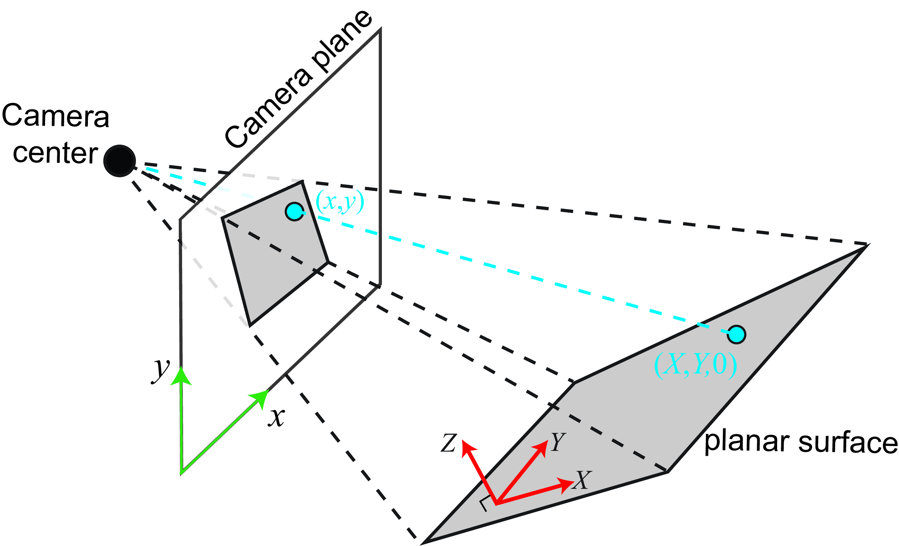

# Homography

resources:
2d and 3d transformations article
vertex shader article

## Pre-note / observation:
In computer graphics during perspective transform we map known 3D coordinates onto an image plane while homography is a general projective mapping between two image planes. However, if the 3D object is planar then 3D projection reduces to homography. So it is interesting to go back to the vertex shader article and contrast the two techniques as they both share many similarities.

# Definition

A homography or projective transformation is a linear geometric transformation that preserves straight lines ie homography is simply a function $h$ that maps points $p$ to points $p'$ with the property that if the points $p$ are colinear then their transformed points $p'$ are also colinear.
$$p' = h(p)$$

$$
\begin{bmatrix}
    x' \\
    y' \\
    w'
    \end{bmatrix}
    =
    \begin{bmatrix}
    a & b & c \\
    d & e & f \\
    g & h & i
    \end{bmatrix}
    \begin{bmatrix}
    x \\
    y \\
    1
    \end{bmatrix}
    \equiv
    p' = Hp
$$

Homographic transformations can represent the all the linear transformations that takes one image plane to another image plane. This can be very useful for:
- image stitching
- document rectification
- planar pose estimation
Or any transformation that takes a flat and turns it into another flat plane. 

$\star$
In short, a homography works iff all observed points lie on a single 3D plane OR the camera undergoes pure rotation.

If you have points with different depths in a scene then you cannot use  only homography to model the transformation that takes you from one view to another. Similarly if your camera moves in a scene with depth variation then the mapping is no longer planar. 

# Planar Homography

Lets say you have a picture of a wall, tabletop, or any planar object in 3D and want to find the transformation that maps the 3D coordinates of the object to the image plane. 

Since the world coordinate system can be defined anywhere lets place it relative to the plane such that the plane is defined by $Z_w = 0$.

In general, when doing perspective projection we transform the homogeneous world-space coordinates of an object into the homogeneous image-plane coordinates which we transform into 2D image coordinates by doing a perspective divide (division by $s$).

The full perspective projection equation in matrix form is

$$s \begin{bmatrix}
u \\ v \\ 1
\end{bmatrix} = K
\begin{bmatrix}
R & t
\end{bmatrix}
\begin{bmatrix}
X_w \\ Y_w \\ Z_w \\ 1
\end{bmatrix}
$$

where
- $(X_w, Y_w, Z_w)$ are the world coordinates of a 3D point  
- $(u, v)$ are the pixel coordinates in the image  
- $R$ is the $3 \times 3$ rotation matrix describing the camera orientation  
- $t$ is the $3 \times 1$ translation vector describing the camera position  
- $K$ is the camera intrinsic matrix  

The intrinsic matrix is
$$
K = \begin{bmatrix}
f_x & 0 & c_x \\
0 & f_y & c_y \\
0 & 0 & 1
\end{bmatrix}
$$
where
- $f_x, f_y$ are the focal lengths measured in pixels  
- $(c_x, c_y)$ is the principal point (the optical center of the image)

Expanding the projection equation gives

$$ s
\begin{bmatrix}
u \\ v \\ 1
\end{bmatrix} = K
\begin{bmatrix}
r_{11} & r_{12} & r_{13} & t_1 \\
r_{21} & r_{22} & r_{23} & t_2 \\
r_{31} & r_{32} & r_{33} & t_3
\end{bmatrix}
\begin{bmatrix}
X_w \\ Y_w \\ Z_w \\ 1
\end{bmatrix}
$$

Finally the 2D pixel coordinates are obtained by performing the perspective divide

$$ u = \frac{x'}{s}, \quad v = \frac{y'}{s}$$  
where

$$
\begin{bmatrix}
x' \\ y' \\ s
\end{bmatrix} = K
\begin{bmatrix}
R & t
\end{bmatrix}
\begin{bmatrix}
X_w \\ Y_w \\ Z_w \\ 1
\end{bmatrix}
$$

$\star$ But since we defined the plane such that $Z_w = 0$ the world point becomes:

$$
\begin{bmatrix}
X_w \\
Y_w \\
0 \\
1
\end{bmatrix}
$$

Substituting into the projection equation gives

$$
s
\begin{bmatrix}
u \\
v \\
1
\end{bmatrix}
=
K
\begin{bmatrix}
r_1 & r_2 & t
\end{bmatrix}
\begin{bmatrix}
X_w \\
Y_w \\
1
\end{bmatrix}
$$

where $r_1$ and $r_2$ are the first two columns of the rotation matrix.

We can define
$$
H = K
\begin{bmatrix}
r_1 & r_2 & t
\end{bmatrix}
$$  
which gives  

$$
s \begin{bmatrix}
u \\ v \\ 1
\end{bmatrix}
= H
\begin{bmatrix}
X_w \\ Y_w \\ 1
\end{bmatrix}
$$

Thus the full 3D camera projection reduces to a $3 \times 3$ homography matrix, which is really just a combination of a 2D translation and rotation matrix times the camera intrinsic matrix. Now that we have the equality above we can equivalently say that their cross product has to be equal to 0 since the cross product of two equivalent vectors is equal to 0.

$$
s \begin{bmatrix}
u \\ v \\ 1
\end{bmatrix}
\times H
\begin{bmatrix}
X_w \\ Y_w \\ 1
\end{bmatrix} = 0
$$

Expanding the entire equation we get:

$$
H =
\begin{bmatrix}
h_{1} & h_{2} & h_{3} \\
h_{4} & h_{5} & h_{6} \\
h_{7} & h_{8} & h_{9}
\end{bmatrix}
$$

$$
s
\begin{bmatrix}
u \\
v \\
1
\end{bmatrix}
\times
\begin{bmatrix}
h_{1}X_w + h_{2}Y_w + h_{3} \\
h_{4}X_w + h_{5}Y_w + h_{6} \\
h_{7}X_w + h_{8}Y_w + h_{9}
\end{bmatrix} = \begin{bmatrix} 0 \\ 0 \\ 0 \end{bmatrix}
$$

$$
\begin{bmatrix}
s v (h_{7}X_w + h_{8}Y_w + h_{9}) - s (h_{4}X_w + h_{5}Y_w + h_{6}) \\
s (h_{1}X_w + h_{2}Y_w + h_{3}) - s u (h_{7}X_w + h_{8}Y_w + h_{9}) \\
s u (h_{4}X_w + h_{5}Y_w + h_{6}) - s v (h_{1}X_w + h_{2}Y_w + h_{3})
\end{bmatrix} = \begin{bmatrix} 0 \\ 0 \\ 0 \end{bmatrix} 
$$

Since the homogeneous scalar $s$ that we divide by to go from homogeneous coordinates to 2D screen space is present on the left and the right is all 0s lets divide by $s$ so we can solve directly for the screen space coordinates. 

$$
\begin{bmatrix}
v (h_{7}X_w + h_{8}Y_w + h_{9}) - (h_{4}X_w + h_{5}Y_w + h_{6}) \\
(h_{1}X_w + h_{2}Y_w + h_{3}) - u (h_{7}X_w + h_{8}Y_w + h_{9}) \\
u (h_{4}X_w + h_{5}Y_w + h_{6}) - v (h_{1}X_w + h_{2}Y_w + h_{3})
\end{bmatrix}
=
\begin{bmatrix} 0 \\ 0 \\ 0 \end{bmatrix}
$$

Notice however that the third equation is actually linearly dependent on the first two. We can see this by rewriting it as

$$
u (h_{4}X_w + h_{5}Y_w + h_{6}) - v (h_{1}X_w + h_{2}Y_w + h_{3})
=
u\Big((h_{4}X_w + h_{5}Y_w + h_{6}) - v(h_{7}X_w + h_{8}Y_w + h_{9})\Big)
+
v\Big((h_{1}X_w + h_{2}Y_w + h_{3}) - u(h_{7}X_w + h_{8}Y_w + h_{9})\Big)
$$

which shows that the third row is simply a linear combination of the first two. Therefore it does not provide any additional independent constraint and can be discarded.

Keeping only the two independent equations gives

$$
v (h_{7}X_w + h_{8}Y_w + h_{9}) - (h_{4}X_w + h_{5}Y_w + h_{6}) = 0
$$

$$
(h_{1}X_w + h_{2}Y_w + h_{3}) - u (h_{7}X_w + h_{8}Y_w + h_{9}) = 0
$$

Now we can rearrange these equations so that the unknown homography entries are factored out:

$$
0\cdot h_1 + 0\cdot h_2 + 0\cdot h_3
- X_w h_4 - Y_w h_5 - h_6
+ vX_w h_7 + vY_w h_8 + v h_9
= 0
$$

$$
X_w h_1 + Y_w h_2 + h_3
+ 0\cdot h_4 + 0\cdot h_5 + 0\cdot h_6
- uX_w h_7 - uY_w h_8 - u h_9
= 0
$$

Nice, so now we just have a system of linear equations with 9 unknowns (the $h$s) that we can rewrite compactly as

$$
\begin{bmatrix}
0 & 0 & 0 & -X_w & -Y_w & -1 & vX_w & vY_w & v \\
X_w & Y_w & 1 & 0 & 0 & 0 & -uX_w & -uY_w & -u
\end{bmatrix}
\begin{bmatrix}
h_1 \\ h_2 \\ h_3 \\ h_4 \\ h_5 \\ h_6 \\ h_7 \\ h_8 \\ h_9
\end{bmatrix}
=
\begin{bmatrix}
0 \\ 0
\end{bmatrix}
$$

Phew, ok that was a lot of algebra and symbolic manipulation, but to recap we are trying to find a transformation matrix that maps planes in 3D to the image plane. Each known point $(X_w, Y_w, Z_w)$ gives us screen coordinates $(u, v)$ which contributes two independent linear constraints on the entries of the homography matrix.

Because the homography has 9 parameters but is defined only up to scale (that is the magnitude of $H = 1$), it has 8 degrees of freedom. Since each point gives two independent equations, we need at least four correspondences to solve for the homography:
$$4 \text{ points} \times 2 \text{ equations per point} = 8$$
This is why four corners of a planar object are enough to estimate its homography. Remember that we defined the world coordinates relative to the plane so if the world-space origin is in the center of a rectangular plane with some width $w$ and height $h$ we can simply plug in the four edge coordinates of the rectangle to satisfy the homography.

Ok so now we know how to solve for $H$ how do we do it computationally in practice?

# Total Least Squares Estimation

four correspondences are enough in theory but in practice:
- corner detections are noisy
- image pixels are discrete
- lens distortion and imperfect calibration introduce error
- clicked or detected points are never exact
