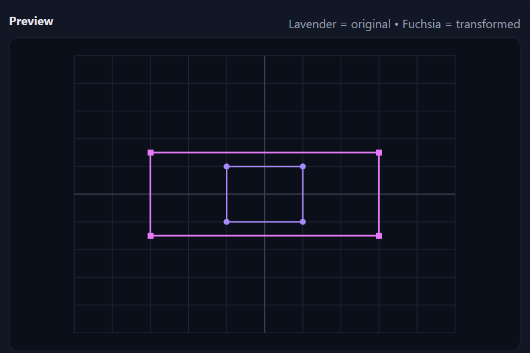
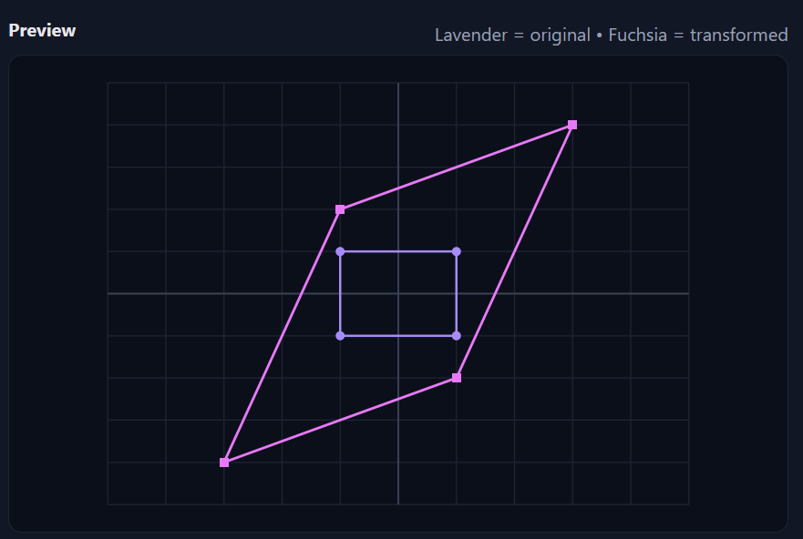
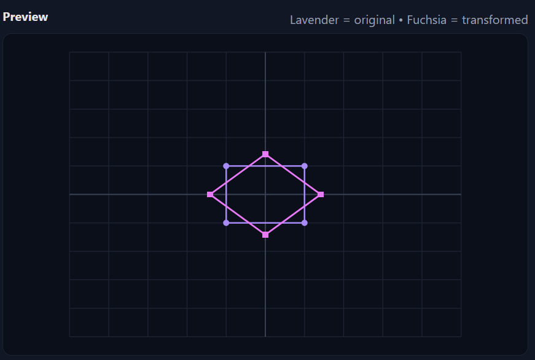
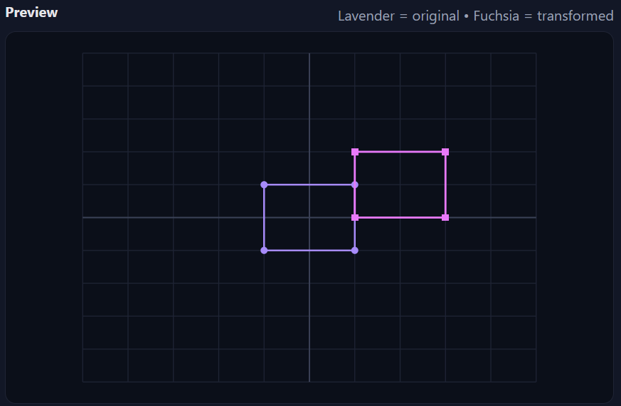
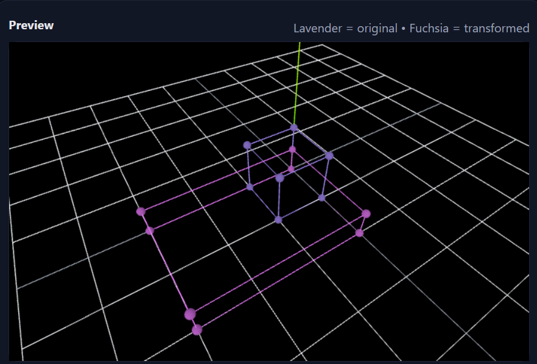
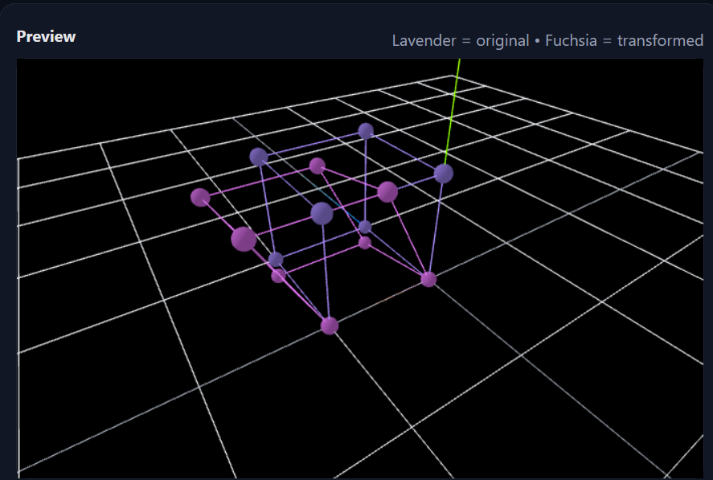
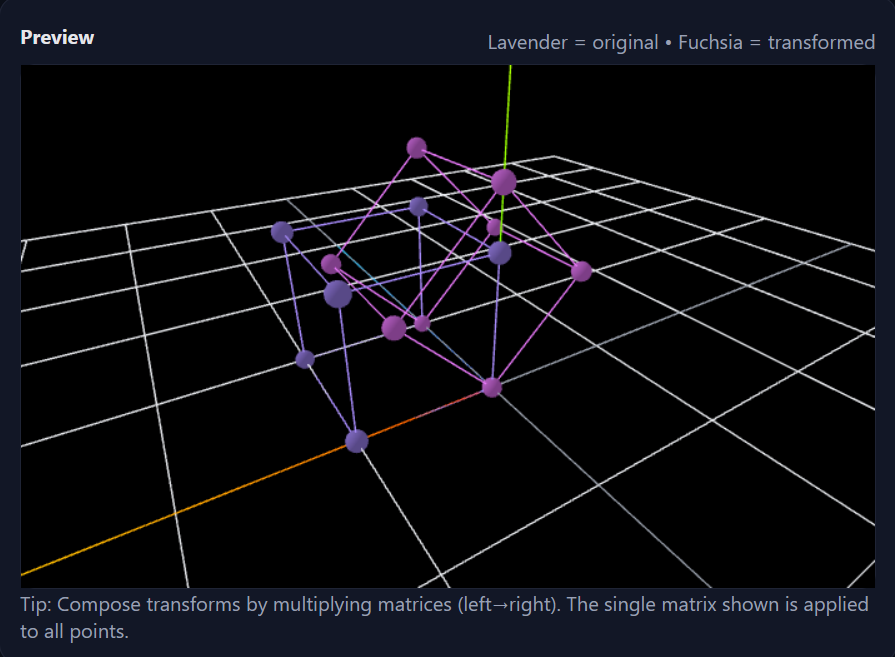
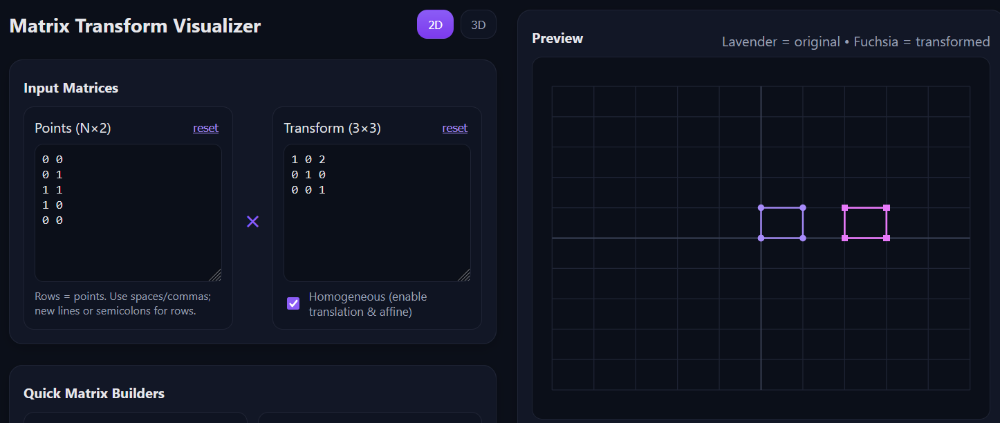
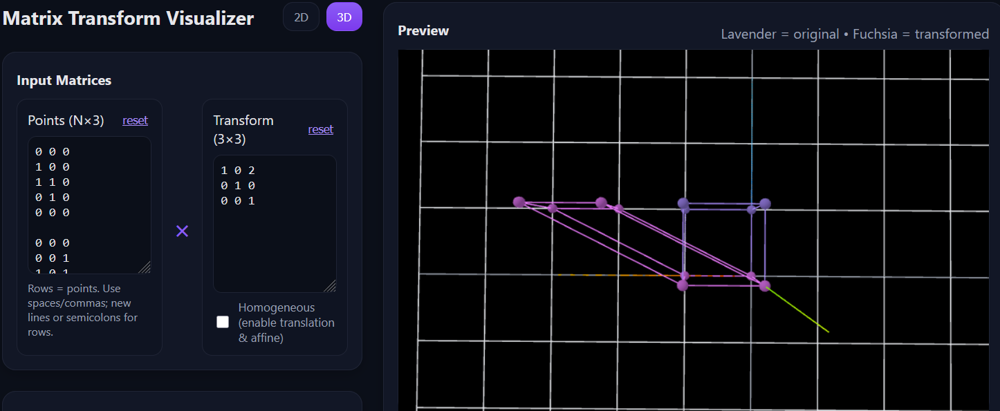

# Matrix Transformations

## Associated [matrix visualizer](https://gabinson200.github.io/matrix_visualizer/) website

Before diving into transformations lets define our goals and some general mathematical background which we will explore to hopefully find representations for functions that we are looking for.

## Goal
Our objective is to find some mathematical function(s) that when given an input of points in $n$ dimensions will transform those points to a different size, rotation, orientation, or shear. 

## Background and definitions

A **matrix transformation** is an function $f:\mathbb{R}^n \rightarrow \mathbb{R}^m$ of the form: 
$$f(x) = Ax$$
where a fixed matrix $A$ is applied or transforms an input vector $x$.
One way to think about this type of broad function, often called transformations or mappings in mathematics, is that it allows us to deal with system of equations or equations with multiple inputs and outputs. Unlike in middle school mathematics where we are constrained to functions where a single input is mapped to a single output, for example the cosine function, now we have a way to define a computational machine that is much more general. However, while this is interesting, it does in a sense expand the search space of our possible functions that we can employ to reach our goal. In reality we can restrict ourselves to a smaller set of linear functions with some nice properties that will be more than enough for our needs. In fact, this subset of functions are the main topic in linear algebra. 

The matrix transformation is a **linear transformation** if it satisfies two fundamental operations; vector addition and scalar multiplication for all vectors $x$, $y$, and scalars $c$.  
**Additivity:**
$$f(x + y) = f(x) + f(y)$$
**Homogeneity:**
$$f(cx) = cf(x)$$ 

Some important effects of the first restrictions (Additivity) are:
- Adding two vectors together and transforming them is the same as transforming each separately and then adding them. 
- If a transformation is a combination of several transformations we can decompose them into those component transformations.
- Knowing where the basis vectors end up after a transformation will allow us to deduce the transformation and subsequently where all other points are mapped. 

Some important effects of the second restrictions (Homogeneity) are:
- If the input is the zero vector in some dimension then the output will be the zero vector in the output dimension.
- No matter by what scalar you multiply or divide a point it will always stay on the same line. 
- If a point divides a segment the ratio by which it divides that segment remains the same after the transformation.

What the restrictions really do is stop us from having non-linear mappings that "bend" and "curve" our inputs, such as trigonometric functions. I know this explanation of linear algebra is woefully inadequate and non-rigorous but some additional context is needed for the transformation matrices we will be discussing shortly. To learn more linear algebra I highly recommend the book: Linear Algebra Done Right or for the people like me that learn best from instructionals 3Blue1Brown's youtube video series: [3B1B Linear Algebra](https://www.youtube.com/playlist?list=PLZHQObOWTQDPD3MizzM2xVFitgF8hE_ab)   

# 2D Transformations in Computer Graphics

Keeping our broader definitions for matrix transformations and linear matrix transformations in mind I want to present some transformations  used to manipulate the position, size, and orientation of objects. These transformations are typically represented by matrices, allowing complex operations to be combined efficiently. Most interestingly, I want to explore the **connection between the computationally efficient way to store transformation matrices and how it closely relates with the ability to perform affine transformations in a lower dimension by doing linear transformations in a higher dimension.** (Please try to keep the previous sentence in the back of your mind as you continue reading for maximum satisfaction.)

## Affine Transformation
An affine transformation is a transformation $T$ that preserves straight lines and parallelism, but not necessarily distances or angles. 

Formally, an affine transformation is an function $f:\mathbb{R}^n \rightarrow \mathbb{R}^m$ of the form: 
$$f(x) = Ax+b$$
where:
- $A$ is a linear transformation matrix (rotation, scaling, shear, reflection, etc.)
- $b$ is an $n \times 1$ translation vector. 

An affine transformation is similar to linear transformation where we relax the homogeneity restriction allowing for mappings that translate the origin or the zero vector to a different point, this is useful as it allows for translation in $n$ dimensions. Importantly, affine transformations preserves straight lines and parallelism but not necessarily lengths or angles. We still preserve the ratio along lines during mappings but now if $b \neq 0$ then the origin is shifted. 

---

# 2D Transformations

Lets go and construct the affine transformations for different 2D transformations. You can play along with this [matrix visualizer]() I made to see how changing the transformation matrix corresponds to different transformations:

## 2D Scaling
The scaling transformation scales vectors in the x or y direction proportional to $s_x$ and $s_y$ scalars respectively. If the scaling factor is between 0 and 1 then it shrinks the vector and if greater then 1 it expands the vector in the specified direction. 
$$A = \begin{pmatrix} s_x & 0 \\\
                      0 & s_y
      \end{pmatrix}
,   
b = \begin{pmatrix}0\\\
                  0 
      \end{pmatrix}

$$

### Example:
$$A = \begin{pmatrix} 3 & 0 \\\
                      0 & 1.5
      \end{pmatrix}
$$

Additionally, a scaling transformation where we flip the sign of the basis vectors ie the signs of $s_x$ and $s_y$ produce reflections. For example if $s_y = -1$ then the y-coordinates of our vectors are flipped creating a reflection around the x-axis, the inverse is true if we flip $s_x$. If we flip both then the result is a reflection about the origin.

## 2D Shearing
The shearing transformation slides vectors parallel to a fixed direction by an amount $k_x$ or $k_y$ proportional to their coordinates along a perpendicular direction, creating slanted shapes that preserve parallelism but not necessarily angles and lengths. 

$$A = \begin{pmatrix} 1 & k_x \\\
                      k_y & 1
      \end{pmatrix}
,   
b = \begin{pmatrix}0\\\
                  0 
      \end{pmatrix}

$$

### Example:
$$A = \begin{pmatrix} 1 & 2 \\\
                      3 & 1
      \end{pmatrix}

$$

## 2D Rotation
The rotation transformation rotates the vector by $\theta$ and is defined as:
$$A = \begin{pmatrix} cos(\theta) & -sin(\theta) \\\
                      sin(\theta) & cos(\theta)
      \end{pmatrix}
,   
b = \begin{pmatrix} 0 \\\
                    0 
      \end{pmatrix}

$$

### Example:

$$A = \begin{pmatrix} cos(45) & -sin(45) \\\
                      sin(45) & cos(45)
      \end{pmatrix}
$$

Another interesting way of looking at rotation matrices is that they encode a specific combination of shearing and scaling that ensure that length and parallelism between inputs remain but the overall angle of each vector is adjusted. One way to mathematically model this is that any invertible transformation matrix $A$ can be viewed as a rotation followed by a scaling, followed by a "corrective" rotation which could be found using Singular Value Decomposition. For pure rotation matrices the singular values all become 1 creating an identity matrix meaning that pure rotation matrices can be decomposed into a product of two rotations. (or a rotation and reflection). Rigorous derivation of rotation vectors from shearing and scaling vectors are beyond the scope of this article but the fact that trigonometric basis vectors like sin and cos produce linear mappings ie. $f(x + y) = f(x) + f(y)$ and $f(cx) = cf(x)$ is very cool and define the building block of Fourier transforms. 

## 2D Translation

Unlike the previous tranformations translations require the translation vector $b$, where $t_x$ translates the vector in the x-direction and $t_y$ translates in the y-direction.

$$A = \begin{pmatrix} 1 & 0 \\\
                      0 & 1
      \end{pmatrix}
,   
b = \begin{pmatrix}t_x\\\
                  t_y 
      \end{pmatrix}

$$

### Example:
$$A = \begin{pmatrix} 1 & 0 \\\
                      0 & 1
      \end{pmatrix}
,   
b = \begin{pmatrix}2\\\
                  1 
      \end{pmatrix}

$$

# 3D Transformations

Keeping the same linear/affine viewpoint as in 2D, a 3D transformation maps a vector $x∈R^3$ to $f(x)=Ax+b$, where $A∈R^{3×3}$ is the linear part (rotation, scaling, shear, reflection, etc.), and $b∈R^3$ is an optional translation vector.

## 3D Scaling
$$A = \begin{pmatrix} s_x & 0 & 0\\\
                      0 & s_y & 0 \\\
                      0 &  0  & s_z

      \end{pmatrix}

b = \begin{pmatrix}0\\\
                   0 \\\
                   0
      \end{pmatrix}

$$

### Example:

$$A = \begin{pmatrix} 2 & 0 & 0 \\\
                      0 & \frac{1}{2} & 0 \\\
                      0 & 0 & 3
      \end{pmatrix}
$$

## 3D Shearing
$$A = \begin{pmatrix} 1 & k_{xy} & k_{xz}\\\
                      k_{yx} & 1 & k_{yz} \\\
                      k_{zx} &  k_{zy}  & 1

      \end{pmatrix}
,   
b = \begin{pmatrix}0\\\
                   0 \\\
                   0
      \end{pmatrix}

$$
​

- $k_{xy}:$ adds a multiple of $y$ into $x$, ie. ($x' = x + k_{xy}y$) 
- $k_{xz}:$ adds a multiple of $z$ into $x$, ie. ($x' = x + k_{xz}z$) 

### Example:

$$A = \begin{pmatrix} 1 & 0.5 & 0 \\\
                      0 & 1 & -0.2 \\\
                      0 & 0 & 1
      \end{pmatrix}
$$

## 3D Rotations
- About the x-axis by $\theta$

$$A = \begin{pmatrix} 1 & 0 & 0 \\\
                      0 & cos(\theta) & -sin(\theta) \\\
                      0 &  sin(\theta)  & cos(\theta)
      \end{pmatrix}
$$

- About the y-axis by $\theta$

$$A = \begin{pmatrix} cos(\theta) & 0 & sin(\theta) \\\
                      0 & 1 & 0 \\\
                      -sin(\theta) & 0  & cos(\theta)

      \end{pmatrix}
$$

- About the z-axis by $\theta$

$$A = \begin{pmatrix} cos(\theta) & -sin(\theta) & 0\\\
                      sin(\theta)  & cos(\theta) & 0 \\\
                      0 & 0 & 1

      \end{pmatrix}
$$
$$
b = \begin{pmatrix}0\\\
                   0 \\\
                   0
      \end{pmatrix}

$$

### Example:
$$A = \begin{pmatrix} cos(45) & -sin(45) & 0\\\
                      sin(45)  & cos(45) & 0 \\\
                      0 & 0 & 1

      \end{pmatrix}
$$

## 3D Translation
$$A = \begin{pmatrix} 1 & 0 & 0\\\
                      0 & 1 & 0 \\\
                      0 &  0  & 1

      \end{pmatrix}
,   
b = \begin{pmatrix}t_x\\\
                   t_y \\\
                   t_z
      \end{pmatrix}

$$

### Example:

$$A = \begin{pmatrix} 1 & 0 & 0\\\
                      0 & 1 & 0 \\\
                      0 &  0  & 1

      \end{pmatrix}
,   
b = \begin{pmatrix}1\\\
                   0.5 \\\
                   2
      \end{pmatrix}

$$

​
## Recap
I hope that looking at the examples and playing around with the website helped to gain some intuition about 2/3D transformations. However, as you may have encountered when trying to translate in 2D or 3D on the website there is no option for a $b$ matrix. If we want to express all 2D transformations in a single matrix so that we could take their products or in other words chain together and express several transformations as a single matrix we need to use another approach. 

# Homogeneous Coordinates

While basic operations like scaling and rotation in N dimensions can be represented by $N \times N$ matrices, translation cannot; it requires vector addition ($p' = p + t$). To unify all transformations into a single matrix multiplication framework, we use **homogeneous coordinates**. This is achieved by representing a 2D vector $(x, y)$ as a 3D vector $(x, y, 1)$, a 3D vector $(x, y, z)$ as a 4D vector $(x, y, z, 1)$ etc.

An affine transformation matrix in homogeneous coordinates in 2D has the general form:
$$\begin{pmatrix} a & b & t_x \\\ d & e & t_y \\\ 0 & 0 & 1 \end{pmatrix} \begin{pmatrix} x \\\ y \\\ 1 \end{pmatrix} = \begin{pmatrix} x' \\\ y' \\\ 1 \end{pmatrix}$$
The final row is always $(0, 0, 1)$ for affine transformations.

---

# Homogeneous Affine 2D Transformations

## Translation
Translation moves an object from one position to another without changing its orientation or size. This is done by adding a translation vector $(t_x, t_y)$ to the point's coordinates.

**Homogeneous Translation Matrix:**
$$T(t_x, t_y) = \begin{pmatrix} 1 & 0 & t_x \\\ 0 & 1 & t_y \\\ 0 & 0 & 1 \end{pmatrix}$$

If we expand the matrix out $$\begin{pmatrix} 1 & 0 & t_x \\\ 0 & 1 & t_y \\\ 0 & 0 & 1 \end{pmatrix}
\begin{pmatrix} x \\\ y \\\ 1 \end{pmatrix} = \begin{pmatrix} x + t_x \\\ y+t_y \\\ 1 \end{pmatrix}$$

## Scaling
Scaling changes the size of an object. It can be uniform (scaling by the same factor in all directions) or non-uniform. The operation is centered on the origin.

**Homogeneous Scaling Matrix:**
    $$S(s_x, s_y) = \begin{pmatrix} s_x & 0 & 0 \\\ 0 & s_y & 0 \\\ 0 & 0 & 1 \end{pmatrix}$$

**Mirroring (Reflection)**: Mirroring is a special case of scaling where one of the scale factors is -1. For example, $S(-1, 1)$ mirrors an object across the y-axis.

## Rotation
Rotation changes the orientation of an object by rotating it around a point, typically the origin, by an angle $\theta$. The derivation uses polar coordinates and trigonometric identities. A point $(x, y)$ is rotated to $(x', y')$ by:

$$x' = x \cos\theta - y \sin\theta$$
$$y' = x \sin\theta + y \cos\theta$$

**Homogeneous Rotation Matrix (for counter-clockwise rotation):**
    $$R(\theta) = \begin{pmatrix} \cos\theta & -\sin\theta & 0 \\\ \sin\theta & \cos\theta & 0 \\\ 0 & 0 & 1 \end{pmatrix}$$

## Shearing
Shearing skews an object; the effect is like pushing a deck of cards from the side. The amount of distortion depends on the point's distance from an invariant axis.

**Horizontal Shear (x-shear):** Shifts x-coordinates based on the y-coordinate. The x-axis is invariant.

$$Sh_x(\beta) = \begin{pmatrix} 1 & \alpha & 0 \\\ 0 & 1 & 0 \\\ 0 & 0 & 1 \end{pmatrix}
\implies
\begin{pmatrix} x' \\\ y' \\\ 1 \end{pmatrix} = \begin{pmatrix} x + \alpha y \\\ y \\\ 1 \end{pmatrix}$$ 

**Vertical Shear (y-shear):** Shifts y-coordinates based on the x-coordinate. The y-axis is invariant.
    $$Sh_y(\beta) = \begin{pmatrix} 1 & 0 & 0 \\\ \beta & 1 & 0 \\\ 0 & 0 & 1 \end{pmatrix}$$

---

# Interpretations of Homogeneous Transformations

## Computational Interpretation

As we see above by introducing homogeneous coordinates in 2D we can describe all transformations as a $3 \times 3$ matrix. This allows us to combine several transformations into a single matrix. Lets say a generic 2D homogeneous matrix is defined as:

$$H = \begin{pmatrix} 
            a & b & t_x \\\ 
            d & e & t_y \\\
            0 & 0 & 1 \
      \end{pmatrix} =
\begin{pmatrix} A & t \\\
                00 & 1 \end{pmatrix}
, A \in \mathbb{R}^{2 \times 2}, t \in \mathbb{R}^2
$$

Then the homogeneous matrix $H_1$ and $H_2$ applied to a point $p$ is:

$$p' = H_2(H_1p) = (H_2H_1)p$$ thus we can multiply the two homogeneous matrices together to get a single unified transformation matrix $H$ that we can apply to any point in one step. The composition of the two matrices will have the form:

$$H = \begin{pmatrix} A_2 & t_2 \\\
                00 & 1 \end{pmatrix}
      \begin{pmatrix} A_1 & t_1 \\\
                00 & 1 \end{pmatrix}
      =
      \begin{pmatrix} A_2A_1 & A_2t_1 + t_2 \\\
                00 & 1 \end{pmatrix}          
      $$

### Homogeneous matrix composition attributes: 
Homogeneous matrix composition is:  
**Associative:** $(H_3H2)H_1 = H_3(H_2H_1)$
but it is **NOT**  
**Commutative:** $H_2H_1 \neq H_1H2$ 

Another interpretation of homogeneous matrix composition is that the resulting matrix $H$ produced from $H_2H_1$ is made up from 2 parts:
- $A = A_2A_1$ or in other words a product of linear matrices representing rotation/scaling/shearing/reflection, but not translation. 
- $t = A_2t_1+t_2$ which is the second linear matrix scaled by the first translation and shifted by the second translation. 

### Points VS Directions

Another computational benefit of using homogenous matrices is we can "turn" the application of translations on and off by switching the bottom 1 in the matrix to which we apply the transformation on and off.  
Ex:
$$\begin{pmatrix} a & b & t_x \\\ d & e & t_y \\\ 0 & 0 & 1 \end{pmatrix} \begin{pmatrix} x \\\ y \\\ w \end{pmatrix} = \begin{pmatrix} x' \\\ y' \\\ 1 \end{pmatrix}, w = 0, 1$$

For example if $A = \begin{pmatrix} a & b \\\ 
                                    d & e 
                    \end{pmatrix} = 
                    \begin{pmatrix} 1 & 0 \\\ 
                                    0 & 1 
                    \end{pmatrix} = I
                    $
then:
- if $w = 1$ the point after applying the transformation is:  $\begin{pmatrix} x+t_x \\\ y+t_y \\\ 1 \end{pmatrix}$

- if $w = 0$ the point after applying the transformation is:  $\begin{pmatrix} x \\\ y \\\ 0 \end{pmatrix}$

or in general: $\begin{pmatrix} x+wt_x \\\ y+wt_y \\\ w \end{pmatrix}$

For example if the matrix which we apply the transformation to represents an actual point in space we want to move then we keep $w=1$ but if the matrix represents a basis vector or something that represents a cardinal (pure) direction then setting $w=0$ prevents it from being translated. 

## Geometric Interpretation

The geometric interpretation of homogeneous transformations is that we "project" an N-dimensional point up a dimension and perform some operation that when projected back down to our original dimension allows for the additional translation transformation that we could not achieve with a single $N \times N$ transformation matrix. If we compare a 3D shearing matrix:
$$A = \begin{pmatrix} 1 & k_{xy} & k_{xz}\\\
                      k_{yx} & 1 & k_{yz} \\\
                      k_{zx} &  k_{zy}  & 1

      \end{pmatrix}
,   
b = \begin{pmatrix}0\\\
                   0 \\\
                   0
      \end{pmatrix}

$$
to a homogeneous 2D translation matrix:  
$$T(t_x, t_y) = \begin{pmatrix} 1 & 0 & t_x \\\ 0 & 1 & t_y \\\ 0 & 0 & 1 \end{pmatrix}$$

we see they are equivalent if we set all out shearing factors to 0 except for $k_{xz}$ and $k_{yz}$, which we set to $t_x$ and $t_y$ respectively. 
Thus we can see that a homogeneous translation matrix in 2D has the same shape as a 3D shearing matrix where we restrict our shearing to the xz and yz planes. The geometric interpretation of this is if we have a point in 2D $\begin{pmatrix}x \\\ y \end{pmatrix}$ then we can represent it as a homogeneous 2D point $\begin{pmatrix}x \\\ y \\\ 1\end{pmatrix}$ which we can visualize as a point in 3D in the same position on the xy plane as our original 2D point but now "floating" one unit up in the z direction. As noted before if we want to represent a 2D direction in homogeneous form then we simply switch the 1 off $\begin{pmatrix}x \\\ y \\\ 0\end{pmatrix}$ which can be interpreted as a point in 3D space that is restricted to the z = 0 plane. Continuing with our 3D shearing interpretation we shear the projected point $\begin{pmatrix}x \\\ y \\\ 1\end{pmatrix}$ by $xz = t_x$ which adds a multiple of z into x and since $z = 1$ and the multiple is $t_x$ it is like shifting all the points in the $z=1$ plane along the x axis by $t_x$, similarly we have the same thing happening when $xy = t_y$ but now along the y-direction in the $z=1$ plane. I encourage you to play around with this 3D shifting on the website just keep in mind that the red line represents the x-axis and the green line represents the y-axis. Ok so we transformed our point in 2D to 3D and applied the shearing in 3D which should be the same as the translation in 2D, our sheared 3D points now while in the correct xy-plane positions but are still sitting 1 unit up the z-axis. To convert between the new sheared 3D location and the translated 2D one we have to divide by the the 3D projected coordinate by $w$ which was equal to 1 in this case. Thus given a 3D vector representing a 2D homogeneous point $\begin{pmatrix}x \\\ y \\\ w\end{pmatrix}$ we have to divide by $w$ to get $\begin{pmatrix}x \\\ y \end{pmatrix} = \begin{pmatrix}x_h/w \\\ y_h / w \end{pmatrix}$ In the case of a point $w=1$ thus it is like directly projecting the points in the z=1 plane directly back down to the xy axis and if $w=0$ then we get a vision by 0 which cannot be interpreted as a finite point only as a pure direction. This means that homogeneous 2D points $(4, 6, 2), (2, 3, 1), (-2, -3, -1)$ all encode the same 2D euclidean point $(2, 3)$. Furthermore, if the x and y points remain the same but we set $w$ equal to something not equal to 0 or 1 then $w$ inversely scales the projection of points on the xy plane. For example if $w>1$ then the euclidean 2D point will have smaller x and y values. The two images below show the 2D homogeneous transformation using a 2D homogeneous translation matrix and the 3D Euclidean shearing equivalent.  

  

## Properties of Transformation Matrices

### The Orthonormal Rotation Matrix
A rotation matrix is a special type of matrix known as **orthonormal**. This means its column vectors (and row vectors) are **mutually orthogonal** (their dot product is 0) and are all **unit vectors** (their magnitude is 1).

A key property of any orthonormal matrix $R$ is that its inverse is simply its transpose:
$$R^{-1} = R^T$$
This is computationally very efficient, as finding the transpose is much faster than calculating a general matrix inverse.

### Inverse Transformations
The inverse of a transformation, $M^{-1}$, is a transformation that undoes the original one, such that $M^{-1}M = I$ (the identity matrix).

* **Translation Inverse**: $T(t_x, t_y)^{-1} = T(-t_x, -t_y)$
* **Scaling Inverse**: $S(s_x, s_y)^{-1} = S(1/s_x, 1/s_y)$.
* **Rotation Inverse**: $R(\theta)^{-1} = R(-\theta) = R(\theta)^T$.

---

## Composing and Chaining Transformations

### Transformations About a Pivot Point
Standard scaling and rotation operations occur relative to the origin. To rotate or scale an object around an arbitrary **pivot point** $(x_c, y_c)$, we must compose several transformations:

1.  **Translate** the object so the pivot point moves to the origin: $T_{in} = T(-x_c, -y_c)$.
2.  **Perform** the desired scaling or rotation: $S(s_x, s_y)$ or $R(\theta)$.
3.  **Translate** the object back to its original position: $T_{out} = T(x_c, y_c)$.

The final transformation matrix $M$ is the product of these individual matrices. Because matrices are applied from right to left, the order is crucial:

$$M = T_{out} \cdot S \cdot T_{in} \quad \text{or} \quad M = T_{out} \cdot R \cdot T_{in}$$
It's far more efficient to pre-multiply these matrices to get a single composite matrix $M$, which can then be applied to every vertex of the object.

### Hierarchical Transformations (Scene Graphs)
Complex objects, like characters or robots, are often modeled as a hierarchy of parts. For example, a character's lower arm moves with the upper arm, and both move with the torso. This relationship can be represented as a tree structure or **scene graph**.

* **Nodes** in the tree represent the geometry of a part (e.g., "Left Upper Arm").
* **Edges** in the tree represent the transformation matrix that positions a child relative to its parent.

To find the final position of a part in the world, you "walk up the chain" from the part to the root of the tree, multiplying the transformation matrices along the way. For a point $p$ on the hand, its final world position $p''$ would be:

$$p'' = M_{Shoulder} \cdot M_{Elbow} \cdot p$$
This structure allows for complex, articulated motion where transforming a parent automatically transforms all of its children.

---

# 3D Transformations Homogeneous Style

Now, instead of $(3 \times 3)$ matrices, 3D transformations use $(4 \times 4)$ homogeneous matrices so that **translation** can also be expressed as a matrix operation.

A 3D point ((x, y, z)) is represented in homogeneous coordinates as:
$$
\begin{pmatrix} x \\\ y \\\ z \\\ 1 \end{pmatrix}
$$

and transformed as:

$$
\begin{pmatrix} x' \\\ y' \\\ z' \\\ 1 \end{pmatrix}
= M
\begin{pmatrix} x \\ y \\ z \\ 1 \end{pmatrix}
$$

Any 3D affine transformation can be represented as:

$$
M =
\begin{pmatrix}
a_{11} & a_{12} & a_{13} & t_x \\
a_{21} & a_{22} & a_{23} & t_y \\
a_{31} & a_{32} & a_{33} & t_z \\
0 & 0 & 0 & 1
\end{pmatrix}
$$

where the upper-left $(3 \times 3)$ submatrix encodes **rotation, scaling, and shear**,
and the last column encodes **translation**.

---

## Translation

Translation moves an object by a displacement vector $(t_x, t_y, t_z)$.

**Homogeneous Translation Matrix:**

$$
T(t_x, t_y, t_z) =
\begin{pmatrix}
1 & 0 & 0 & t_x \\
0 & 1 & 0 & t_y \\
0 & 0 & 1 & t_z \\
0 & 0 & 0 & 1
\end{pmatrix}
$$

$$
\begin{pmatrix} x' \\ y' \\ z' \\ 1 \end{pmatrix}
=
T(t_x, t_y, t_z)
\begin{pmatrix} x \\ y \\ z \\ 1 \end{pmatrix}
=
\begin{pmatrix}
x + t_x \\
y + t_y \\
z + t_z \\
1
\end{pmatrix}
$$

---

## Scaling

Scaling changes the size of an object by factors $(s_x, s_y, s_z)$ along the respective axes.

**Homogeneous Scaling Matrix:**
$$
S(s_x, s_y, s_z) =
\begin{pmatrix}
s_x & 0 & 0 & 0 \\
0 & s_y & 0 & 0 \\
0 & 0 & s_z & 0 \\
0 & 0 & 0 & 1
\end{pmatrix}
$$

---

## Rotation

3D rotation can occur about any of the three principal axes or an arbitrary axis.

### Rotation about the **x-axis**

$$
R_x(\theta) =
\begin{pmatrix}
1 & 0 & 0 & 0 \\
0 & \cos\theta & -\sin\theta & 0 \\
0 & \sin\theta & \cos\theta & 0 \\
0 & 0 & 0 & 1
\end{pmatrix}
$$

### Rotation about the **y-axis**

$$
R_y(\theta) =
\begin{pmatrix}
\cos\theta & 0 & \sin\theta & 0 \\
0 & 1 & 0 & 0 \\
-\sin\theta & 0 & \cos\theta & 0 \\
0 & 0 & 0 & 1
\end{pmatrix}
$$

### Rotation about the **z-axis**
$$
R_z(\theta) =
\begin{pmatrix}
\cos\theta & -\sin\theta & 0 & 0 \\
\sin\theta & \cos\theta & 0 & 0 \\
0 & 0 & 1 & 0 \\
0 & 0 & 0 & 1
\end{pmatrix}
$$

---

## Shearing

Shearing skews an object so that its shape is deformed along one or more axes.
In 3D, there are **six possible shear coefficients** one for each pair of axes.

**General 3D Shear Matrix:**
$$
Sh =
\begin{pmatrix}
1 & sh_{xy} & sh_{xz} & 0 \\
sh_{yx} & 1 & sh_{yz} & 0 \\
sh_{zx} & sh_{zy} & 1 & 0 \\
0 & 0 & 0 & 1
\end{pmatrix}
$$

Each $(sh_{ij})$ controls how much the $i$-coordinate shifts in proportion to $j$.

---

## Reflection (Mirroring)

Reflection is a special case of scaling where one of the scaling factors is negative.

For example:

* Reflection across the **xy-plane** (negate z):
$$
  R_{xy} =
  \begin{pmatrix}
  1 & 0 & 0 & 0 \\
  0 & 1 & 0 & 0 \\
  0 & 0 & -1 & 0 \\
  0 & 0 & 0 & 1
  \end{pmatrix}
$$

* Reflection across the **yz-plane** (negate x):
$$
  R_{yz} =
  \begin{pmatrix}
  -1 & 0 & 0 & 0 \\
  0 & 1 & 0 & 0 \\
  0 & 0 & 1 & 0 \\
  0 & 0 & 0 & 1
  \end{pmatrix}
$$

## Composite Transformations

As in 2D, multiple 3D transformations can be combined by **matrix multiplication**.

For instance, to **rotate, then translate**, the combined transformation is:
$$
M = T(t_x, t_y, t_z) \cdot R_y(\theta)
$$
so that:
$$
p' = M \cdot p
$$

Because matrix multiplication is **not commutative**, the order matters $(R \cdot T \neq T \cdot R)$.

## 3D Rotation about an arbitrary unit axis $u$
Let $u = (u_x, u_y, u_z)$ be a unit axis and angle $\theta$. Rodrigues' formula:

$$A = cos(\theta)I + (1-cos(\theta))uu^t + sin(\theta)[u]_x$$; where 

$$[u]_x = \begin{pmatrix}
                      0 & -u_z & u_y\\\
                      u_z & 0 & -u_x \\\
                      -u_y &  u_x  & 0

      \end{pmatrix}
      $$

### Example:

$$A = \begin{pmatrix} 1 & 0.5 & 0 \\\
                      0 & 1 & -0.2 \\\
                      0 & 0 & 1
      \end{pmatrix}
$$

