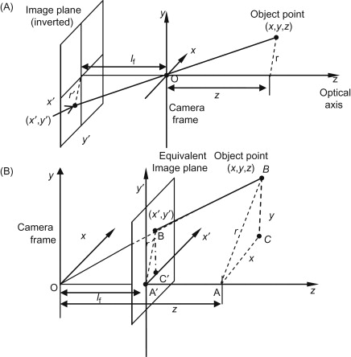
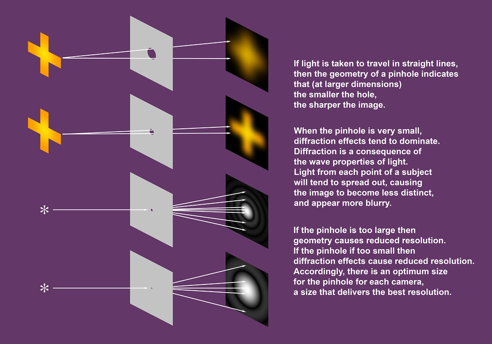
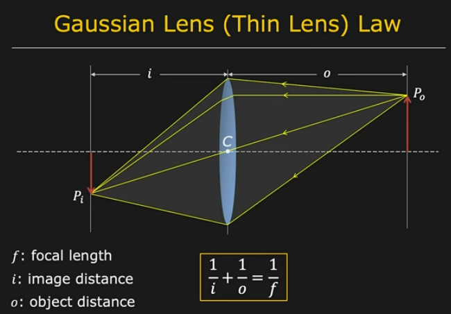
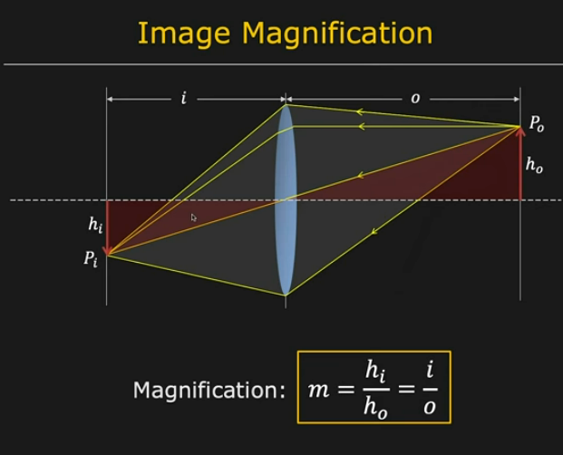
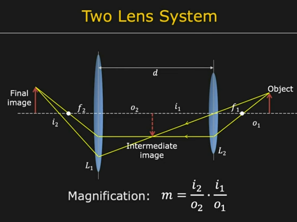
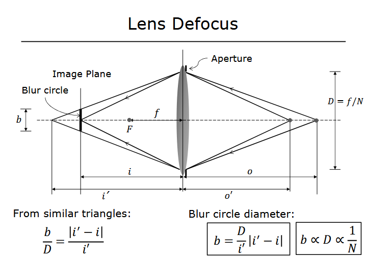
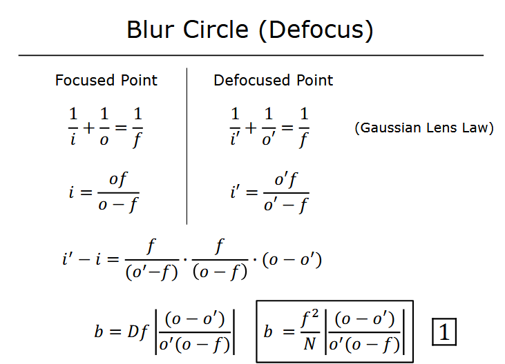
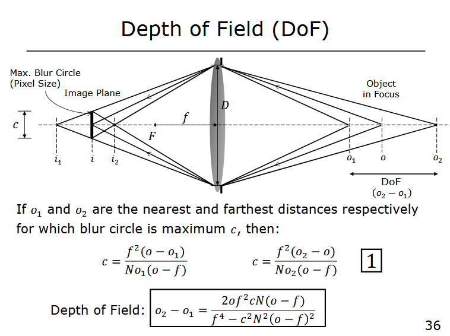

# Cameras and Camera Calibration

In this article I'll explore the real world construction of cameras and the theoretical model of cameras we can use in computer vision and graphics to model the way in which cameras take photos.

Fun Fact: Photography is the combination of the Greek words "photo" meaning light, and "graph" meaning writing/drawing. Thus photography roughly translates to light drawing which is a very fitting name.

The most basic function of all cameras is capturing incoming light rays bouncing off of objects in view of the camera and projecting those rays of light onto some medium. 

## [Brief History](https://www.britannica.com/technology/photography/Photographys-early-evolution-c-1840-c-1900)

I will not go into a long account of the history of cameras as there are many resources for that online but the mayor milestones of camera development are defined by:
- Camera obscura: a dark room with a small hole that projects an image of the outside world onto the wall of the room. Known since 4th century BC.  
- Projection onto chemical mediums: The capture of light onto more stable, longer lasting, and faster reacting mediums such as: silver-plated copper, glass-based collodion, Palladium, and film. 
- Improvements in lens design: Improvements to lens led to less blur, distortion, and chromatic aberration allowing for shaper images, faster apertures, and overall less image distortion.

## Pinhole and perspective projection

When there is a source of light there is an innumerable amount of rays of light emitted from the light source bouncing around our surrounding based on the relative position of the objects and material properties of the objects. The concept of photography can then be defined as a way to capture some of that light onto some medium in such a way that the medium changes or stores some information about the amount and position of the captured rays. The simples way to do this is to define an area or plane on which we want to capture the light and a small sheet with a hole in it, called a pinhole, through which light from the scene can pass and land on the image plane.

As seen in the upper part of the image above given an object point $ P_w:(x_w, y_w, z_w)$ in 3D world space, the some rays of light bouncing off that point will go through the pinhole $O$, which defines the origin of the world coordinate system, and project upside down onto the image plane with local 2D coordinates $P_l:(x', y')$ and 3D world coordinates $(x_l, y_l, l_f)$. Besides the world position of the point the only other value influencing the projection of the point from world space onto the image plane is the distance from the pinhole to the image plane called the focal length $l_f$. Because the ray creates two similar triangles with a shared vertex at the pinhole we can say that the relative length between $\vec{P_wO}$ and $\vec{OP_l}$ are linearly related: $\frac{\vec{OP_l}}{l_f} = \frac{\vec{P_wO}}{z_w}$ which can be broken down into its $x$ and $y$ components. This type of perspective projection created by a pinhole camera performs a linear transformation in mathematical terms which mean that a straight line in world space will remain a straight line in image space and the relative distance between objects in world space will be preserved in image space, although there may be a linear scaling or magnification during the projection. This magnification factor $m$ is simply the ratio of the distance of the image plane from the pinhole $|\vec{OP_l}|$ over the distance between the point in world space to the pinhole $|\vec{P_wO}|$ thus $|m| = \frac{|\vec{OP_l}|}{|\vec{P_wO}|} = \frac{l_f}{z_w}$. This means that the size of a point on the image is inversely proportional to the depth of that point in world space, ie. the farther away the object is from the pinhole the smaller it is on the image plane. The point on the image plane relative to which the projected points disappear is called the vanishing point, and has image plane location $(x',y') = (l_f\frac{x_w}{z_w}, l_f\frac{y_w}{z_w}) = (|m|x_w, |m|x_w)$. The amount of light landing on the image plane is also a function of the size of the pinhole, if you make the pinhole too big the amount of incoming light from a point on the object covers too big of an area on the image plabe causing blurring. On the other hand, if you make the pinhole too small the projected image will also become blurry because of diffraction. 
In practive the effective pinhole size is: $$d = 2 \sqrt{l_f \lambda}$$ where $\lambda$ is the wavelength of light, about 500 nanometers. 
These type of pinhole cameras have the nice property of producing images where all parts of the image are in focus at the expense of much longer exposure time.

## Lenses

The motivation behind using lenses in photography is to capture more rays of light bouncing off of an object onto the image plane using the refractive property of the lens. Thin lenses have some intrinsic focal length $f$ (determined by the material and shape of the lens) which is equal to $\frac{1}{i} + \frac{1}{o}$ where $i$ is the length from the lens to the image plane and $o$ is the length from the lens to the object. The focal length $f$ can be determined by projecting a really far away object, like the sun, onto an image plane, which sets $o = inf.$ thus making $f = i$. Thus measuring the distance from the lens to the image plane when the far away object comes into focus can be used to find the focal length. 

The image magnification due to a lens is

We can also chain together different lenses to achieve a multiplicative magnification factor. 

Using an adjustable aperture we can control the light receiving area of the lens, ie diameter of a lens. We can express aperture diamater $D$ as a fraction of focal length $D = f / N$ where $N$ is the f-number of the lens, or inversely $N = f / D$. While a len allows us to gather more light from our scene it has the drawback of only having a single plane in world space in focus. This leads to blurring of obects too close or too far from the lens.  Using similar triangles again we see that the magnitude of the blurring effect depends on how far away from the focused plane the image plane is (which depends on the location of the object in world space) and the ration of the aperture diameter over the distance to the image plane. 

The range of world distances over which the image is "well" focused range over the distance where the blur circle diameter is less than the size of a pixel or other finite area which represents the projected image, this distance is called the depth of field, DoF. The depth of field can be calculated as: 

## Biological eyes

