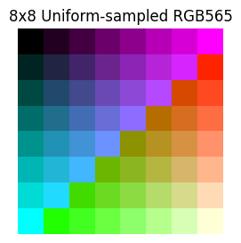
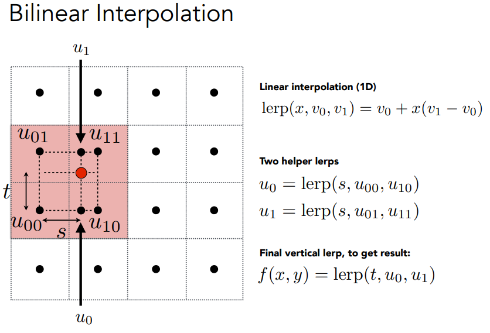
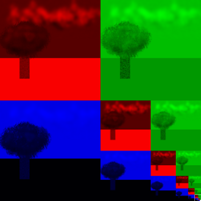
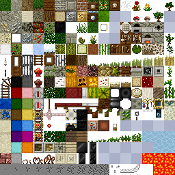
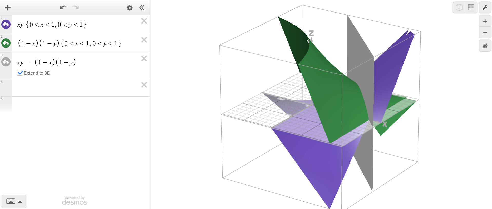

# Textures

### Resources:
[texture mapping wiki](https://en.wikipedia.org/wiki/Texture_mapping)

Textures are simply images that we want to apply to the surface(s) of a mesh.

## Texture Mapping
Mapping a texture consists of defining a function that maps the 2D (u, v) coordinates and associated color of the flat texture image onto the surface of the mesh.
More accurately, since the mesh is defined by triangles or other primitives what we want to do is for each primitive in the mesh assign it's vertices (which are in a 2D plane) to some position on the texture. So, instead of wrapping a texture image around a mesh we are flattening the mesh primitives onto the texture. This mapping is usually manually done by artists and programmers.

## Texture Sampling
So, how do we assign a color at a specific 2D coordinate (u, v) to a 3D point (x, y, z) in world space? Furthermore, colors in a texture are represented by pixels which are quantized, non-continuous values. Consider an 8 by 8 grid of pixels with different colors in each pixel:

The information represented by this image is that for integer coordinates (0...7, 0...7) there is a specific color value at that point in space, this bit of color information can be compressed into a point called a texel which can be thought of as the center of each pixel (0.5...7.5, 0.5...7.5). These colored texels can then be sampled at non-integer intervals to produce different color assignments based on some filtering function. Using the pixel height and width of the texture gives us the $u$ and $v$ coordinates and normalizing the height and width to $[0,1]x[0,1]$ yields the $s$ and $t$ coordinates. Note: when people refer to uv coordinates they usually mean the normalized st values. Working in normalized coordinates allows for easier switching of higher or lower resolution textures so that even when switching between textures the same st coordinates reference the same area in the textures. (This will come in handy with mipmaps)

## Filtering Methods

### Nearest Filtering
Simply, take the color of the nearest texel. Note: if the texels are arranged in a grid of uniform spacing (such is the case with uniform pixel sizes) then any distance function manhattan or euclidean will return the same $argmin$ nearest point.

### Bilinear Filtering
Take the 4 closest texels to the chosen point and interpolate twice along the horizontal or vertical sides of the square defined by the 4 nearest points and interpolate once more between those two points. Note: bilinear interpolation allows us to smoothly interpolate in 2D with 3 linear interpolations.
Extra: we can rewrite the three lerps for a point c inside a square with edges p0 ... p3:

$$c_{01} = (1-s)p_0 + sp_1, c_{23} = (1-s)p_2 + sp_3, c = (1-t)p_{01} + tp_{23}$$

with substitution as

$$c = (1-t)(1-s)p_0 + (1-t)sp_1 + t(1-s)p_2 + tsp_3$$

Which can be interpreted as a linear combination of points weighted by the area of the opposite rectangle they produce with $c$.

Consider the fact objects father away from you take up less of your visual field and thus the colors that make up the object begin to blend together the farther the object is from you. This effect is even more perceivable when working with small screen resolutions.
The issue with bilinear filtering is that if the mesh / object we applied the texture to, becomes small or too far away from the camera the amount of physical screen pixels that represent that object shrinks. But to accurately color those screen pixel with the correct color from the texture we need to sample some increasingly lage part of the texture for an average color to shade our screenspace pixels. This averaging is very computationally expensive, even worse if we use bilinear filtering there can be some intense color jittering as the sampled point across the texture can vary wildly with very small camera movement. The solution? Prefiltering with mipmaps.

### Mipmaps
Idea: We will generate different versions (levels) of the texture with decreasing resolution that can be bilinear sampled depending on the amount of screenspace pixels the textured mesh will take up. Ideally, at each level of resolution the pixel size in texture space corresponds to a possible fragment / pixel in world space, but this is obviously very rare so what we want to do is additionally interpolate between mipmap resolution levels. We bilinear filter two texture resolutions to get two different colors for position in texture space and then linearly interpolate those results. This is called **trilinear filtering**.
This solves the flickering issue at the cost of some memory but we still end up with far away objects blending together too much / incorrectly since the projection in pixel space might not be composed of head on views of flat textures but with each pixel's color determined by some non-square area of the texture map. (this is all extremely visual and hard to write down just watch the lecture linked above).

If you implement mipmaps, you’ll typically store a chain of levels:
- Level 0: original resolution
- Level 1: half width/height
- ...
- Until 1x1

### Anisotropic filtering with mipmaps
This can be achieved by sampling multiple smaller mipmap boxes along the visible portion of the mesh and computing mipmaps with trilinear filtering on those boxes. This results in a much better texture filtering quality but it is much more expensive.

## Wrap Modes
Wrap modes are per-axis addressing rules (one for $u$ and one for $v$) that define what happens when your texture coordinates go out of range. Importantly, the addressing mode is applied before filtering: the sampler first maps an out-of-range coordinate back into a valid region (or decides it should use a border value), and then performs nearest/bilinear/mipmap filtering using the resulting coordinates.

Common wrap modes:

- **Repeat / Wrap**
  The texture tiles infinitely. Conceptually:
  $u' = \mathrm{fract}(u),\quad v' = \mathrm{fract}(v)$
  so $u=1.2 \mapsto 0.2$ and $u=-0.25 \mapsto 0.75$.
  Default “tiling” behavior used for things like floors, walls, and patterned materials.

- **Mirrored Repeat**
  Like repeat, but every other tile is flipped, which helps hide seams for some patterns:
  $$
  u' =
  \begin{cases}
  \mathrm{fract}(u) & \text{if }\lfloor u \rfloor \text{ is even}\\
  1-\mathrm{fract}(u) & \text{if }\lfloor u \rfloor \text{ is odd}
  \end{cases}
  $$
  (and similarly for $v$). This produces a back-and-forth mirrored tiling.

- **Clamp to Edge**
  Clamp coordinates into $[0,1]$ so sampling outside the texture returns the nearest edge texel:
  $u'=\min(1,\max(0,u)),\quad v'=\min(1,\max(0,v))$
  Visually, this “smears” the edge color outward. It’s commonly used for decals, sprites, UI, and any texture where tiling would look wrong.

- **Clamp to Border**
  If you sample outside $[0,1]$, you get a fixed **border color** instead of repeating/clamping edge texels. This can be useful for projected textures like spotlights or to ensure that sampling outside the valid range becomes “transparent/black” rather than pulling in unrelated texels.

**Important practical note (especially with bilinear/mipmaps):** filtering pulls from *multiple* texels. Near the edges, bilinear sampling can read texels “past” the border. That means your wrap mode choice directly affects whether you see seams: repeat can “wrap in” texels from the opposite side, clamp-to-edge avoids wrapping seams, and clamp-to-border can prevent edge bleeding if the border color is appropriate.

## Samplers
Another idea is that different meshes in our scene might use different sampling methods and wrap modes for performance or level of detail (LOD); so we can define and assign different samplers to use the same texture data.
A useful mental model is:
- **Texture data** = the pixels (texels) stored in memory
- **Sampler (state)** = the *policy* for reading those pixels (filtering, mip/LOD behavior, wrap mode, etc.)
That separation lets you reuse the same texture bytes with different behavior depending on what mesh/material needs.

### Typical Sampler

**Addressing / wrap mode** per axis: `repeat`, `mirror`, `clamp_edge`, `clamp_border`  
**Minification filter**: what to do when the texture is being shrunk (nearest vs mipmapped)  
**Magnification filter**: what to do when the texture is being enlarged (nearest vs bilinear)  
**Mip behavior (optional)**:  
  - `mip_mode`: nearest mip vs linear between mips (trilinear)
  - `lod_bias`: bias toward sharper or blurrier mip levels
  - `min_lod`, `max_lod`: clamp allowable mip levels  

**Border color** (if clamp-to-border is used)    
**Anisotropy**: number of mipmap samples (-1 if off)  

### Why use different samplers on the same texture?
Different meshes often want different tradeoffs even when they share the same texture:

- **UI / decals / sprites**: `clamp_edge` to avoid wrapping seams + often `nearest` for crisp pixel edges
- **Tiled surfaces (floors/walls)**: `repeat` so patterns tile
- **Hero objects close to camera**: `bilinear` to remove blockiness
- **Far objects**: `nearest + mipmaps` to reduce shimmer with minimal cost
- **Special cases**: `clamp_border` for “outside should be transparent/black”

So you we need duplicate textures like “brick_repeat” or “brick_clamp” we just reuse the brick texture and swap samplers.

Picking a sampler (or LOD) automatically:
If you want basic LOD without heavy derivatives, you can make a coarse per-triangle estimate:
- If the triangle is small on screen (few pixels), or UVs change fast across the triangle then prefer a lower mip
- If UVs are magnified then prefer bilinear (or just nearest if you want the PS1 look)

## Textures in memory and optimizations
I will not explore GPU texture mapping here as I'm working on a CPU rasterizer right now, but it is important to note that keeping textures stored in "hot" memory or lower level caches is important since as the vertices on our object(s) go in and out of view we will need to sample the texture data per vertex per frame.

### Mipmap optimizations:
- Store each mip level as a contiguous block.
- Keep metadata per level: `(w, h, stride, data_ptr)` so sampling code can switch levels cheaply.
If you know your textures are power-of-two, address math can also be cheaper (wrapping becomes bitmasking).

### Texture atlases
If you have lots of small textures (sprites, UI, icons), packing them into a texture atlas can reduce:
- per-object texture switching overhead
- number of separate allocations (fragmentation)

Note: If you use bilinear filtering with an atlas, you generally want to add padding around each sub-texture region so the 2x2 bilinear neighborhood doesn’t bleed into a neighbor tile.

### Small software renderer tricks that help a lot
- Keep a tiny **line cache** when doing bilinear: you often fetch from two adjacent rows; caching the last row (or last few rows) can reduce repeated loads.
- Prefer incremental interpolation (per-pixel `u += du_dx`) rather than recomputing from scratch.
- Precompute stride, base_ptr, and any “wrap masks” so the inner loop is as small as possible.

## Hardware

TLDR for esp32: try to implement all but no anisotropic for esp32

**Sega Dreamcast**
https://segaretro.org/Sega_Dreamcast/Hardware_comparison

https://segaretro.org/Sega_Dreamcast/Technical_specifications

Linear, bilinear and trilinear filtering (using mipmaps)

more ahead of the time then PS2.

**PS2**
Bilinear + Mipmaps + Trilinear
